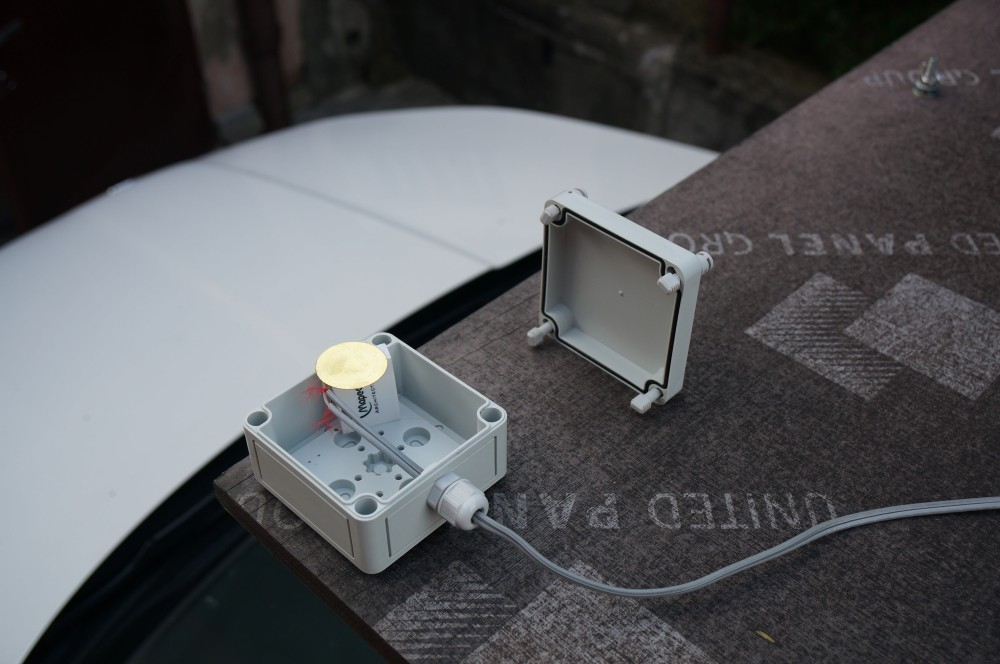
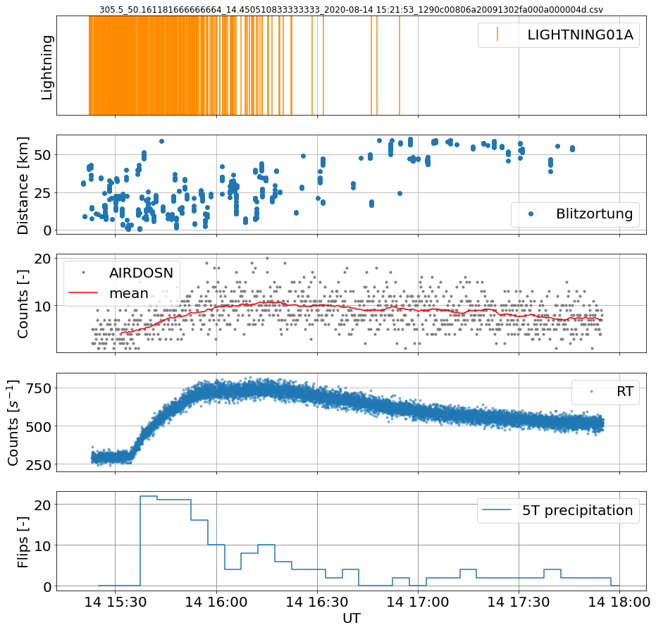
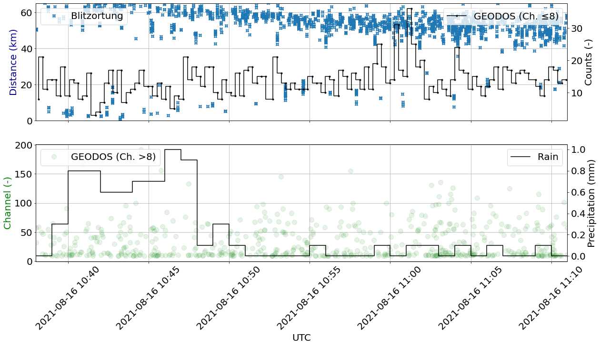
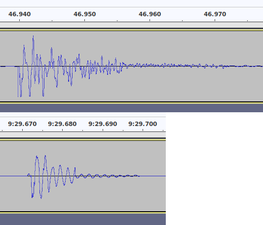

# DISDROMETER01 — Piezoelectric Precipitation Disdrometer

DISDROMETER01 is a compact precipitation sensor that simultaneously measures **intensity, drop-size distribution, and hydrometeor type** (rain, hail, graupel, snow). Unlike traditional tipping-bucket gauges, it offers true real-time resolution and works on a *moving* platform — it has been specifically designed for installation on the flat roof platform of a measurement vehicle and exposes its raw waveform output for advanced post-processing.

## Why a disdrometer at all?

Atmospheric ionizing radiation measurements at ground level depend critically on the ability to *exclude* radon-progeny washout from the lightning-related signal of interest. Rain rinses radon decay products out of the lower atmosphere onto the ground, where they raise the gamma background by tens of percent for tens of minutes after rainfall onset — a temporary increase that is easy to misinterpret as a Thunderstorm Ground Enhancement (TGE) if the precipitation history is unknown:

A standard tipping-bucket rain gauge resolves rain *volume* but cannot distinguish hydrometeor types and has a temporal resolution that drops with low rain intensity — the lull periods often dominate the measurement window:

For a thunderstorm experiment, the variables of interest are exactly the ones the tipping bucket cannot deliver: instantaneous rain rate, hydrometeor type, and the timing of the precipitation pulses relative to the lightning history. Commercial optical disdrometers in principle resolve drop size and type but are not mechanically robust on a vehicle roof in motion. DISDROMETER01 addresses both gaps by measuring the **acoustic impulse** that each falling hydrometeor delivers to a calibrated impact plate.

## Sensing principle

A piezoelectric element is bonded to the inner side of a plastic enclosure with a defined impact surface area. Every drop, hailstone or graupel that hits the enclosure generates a mechanical pulse that the piezo converts into a voltage transient. The transient is amplified and digitized by an SDR receiver (the same family of receivers used elsewhere by UST — for example in [RSMS](/RSMS/)), so the raw acoustic waveform of each impact is available for analysis, not just a counter increment.

Different hydrometeors produce distinctly different waveforms — rain has a fast, narrow impact pulse with a short ringing tail; hail produces a much higher-amplitude, longer-decaying pulse with characteristic re-bounce ringing. The difference is large enough that a classifier can be implemented purely on the per-impact waveform:

Because the entire raw waveform is preserved, custom classifiers can be developed for use cases that current commercial instruments do not address (e.g. distinguishing graupel from small hail, or characterising sleet vs. cold rain transitions).

## Deployment scenarios

* **Vehicle roof platforms.** The instrument was designed specifically for this case, and is robust to driving wind loads and to vibrations from rough roads — unlike most commercial optical disdrometers, which are extremely sensitive to vehicle motion.
* **Stationary observatories.** Lower-noise installation on a non-resonant fixed base also works; the same waveform-level classifier applies.
* **As an auxiliary in radiation campaigns.** Direct use case: rule out radon-progeny washout as the cause of ground-level radiation excursions during thunderstorm observation.
* **As an alternative weather radar disambiguator.** Pairs naturally with downward-looking radar to tell rain–hail transitions in real time.

## Project status and source

DISDROMETER01 is published as open hardware at
[github.com/UniversalScientificTechnologies/DISDROMETER01](https://github.com/UniversalScientificTechnologies/DISDROMETER01). The SDR receiver technology used for the readout was originally developed for the [Bolidozor](https://bolidozor.cz) meteor detection network, and is reused here for the piezoelectric front-end.

## Related publications

* J. Kákona, [_Detection of Electromagnetic Phenomena in the Atmosphere – Integrating Advanced Instrumentation and UAVs for Enhanced Atmospheric Research_](https://dspace.cvut.cz/handle/10467/120570), doctoral thesis, CTU in Prague, 2025.
