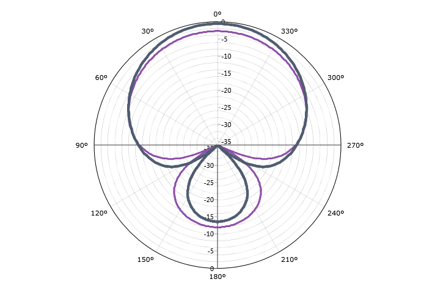
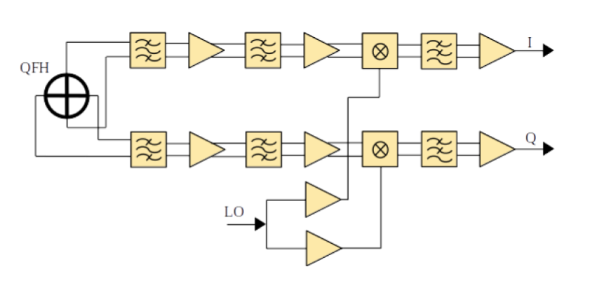
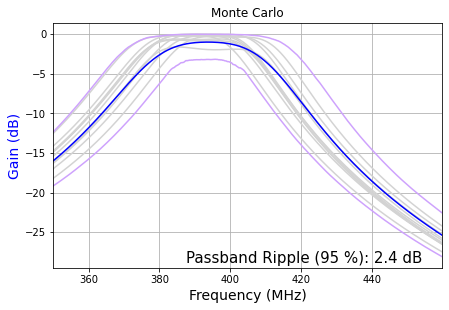
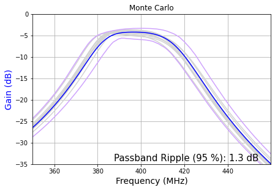
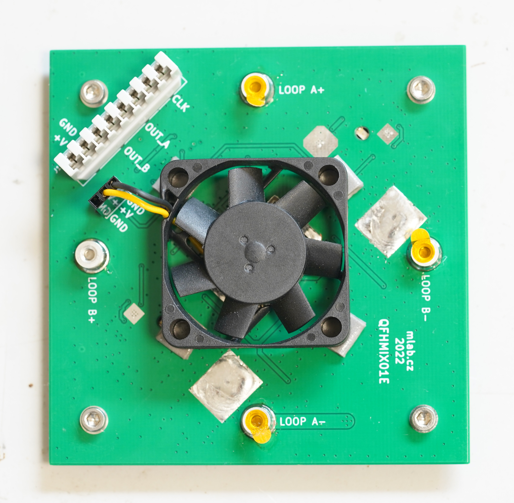
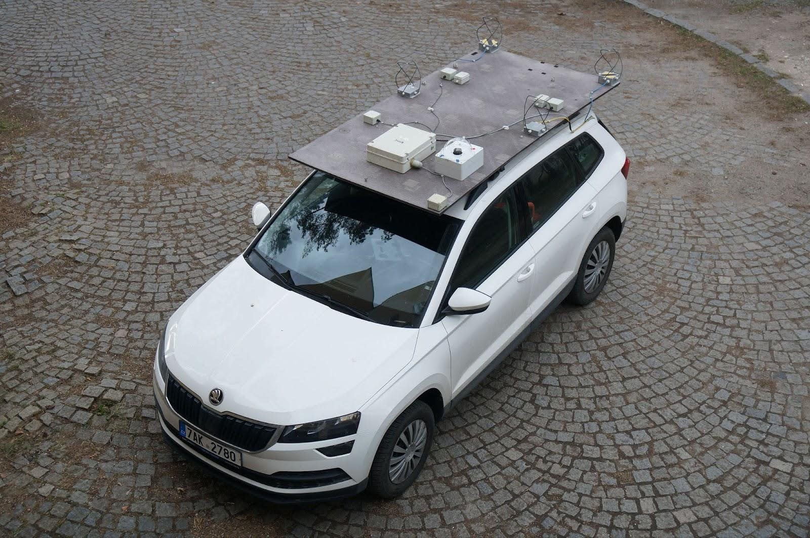

# RSMS01 – UHF Radio Storm Monitoring Station

RSMS01 is a UHF lightning observation station designed for ground or vehicle-mounted deployments. It complements the [RSMS02](/RSMS02/) VLF receiver, which provides triggering and coarse detection. Together, both instruments capture long, contiguous, and time-synchronized RF segments of lightning activity for detailed post-processing. The system was conceived for research applications requiring high temporal accuracy and wide dynamic range, allowing detailed analysis of lightning structure and propagation.

## Functional Overview

The receiver operates in the UHF band around 400 MHz, providing a contiguous 10 MHz capture window. This band is particularly rich in signatures of the initial lightning breakdown and leader formation, offering complementary information to lower-frequency systems. Each RSMS01 station combines a four-element antenna array, active front-end modules, and a base unit with high-speed digitizers. Signals from the antennas are fed as differential I/Q pairs over shielded CAT6 cabling, ensuring low noise and excellent channel synchronization even during mobile operation.

During operation, the VLF station (RSMS02) detects strong electromagnetic impulses associated with lightning and sends a trigger to RSMS01. The UHF station then preserves a selected time segment of the continuous radio stream — typically about 1.45 seconds — including data both before and after the trigger. Embedded GNSS-derived time marks make it possible to align individual samples with absolute UTC, which enables cross-correlation with optical, electric-field, or radiation sensors.

## Technical Parameters

| Parameter             | Typical value / range      | Notes                                 |
| --------------------- | -------------------------- | ------------------------------------- |
| **Frequency band**    | 370–406 MHz                | Tunable within local RFI constraints  |
| **Sampling rate**     | 10 MSPS                    | 12‑bit resolution per I/Q channel     |
| **THD (Total Harmonic Distortion)** | ≈ −65 dBFS                         | Typical at 1 MHz input                |
| **Signal-to-Noise and Distortion Ratio  (SINAD)**                           | ≈ 63 dB                         | Optimal signal conditions       |
| **Input impedance**                 | ≈ 5 kΩ                             | Differential, ~2 pF input capacitance |
| **Input referred noise**            | ≈ 5.5 nV/√Hz                       | At VGA gain = 31 dB                   |
| **VGA gain range**                  | −5 dB to +31 dB                    | Step size 0.125/1 dB                  |
| **Antenna type**      | 4× QFH (Quadrifilar Helix) | Circularly polarized, omnidirectional |
| **Antenna connection**    | CAT6 differential pairs    | 100 Ω, low‑noise I/Q link             |
| **Number of channels**              | 4 QFH antennas    | Each antenna use one I/Q channel |
| **Capture bandwidth** | 10 MHz I/Q complex         | Contiguous spectrum segment           |
| **Recording length**  | up to 1.45 s per event      | Configurable pre/post number of blocks        |
| **Timing source**     | PPS                   | From external GNSS receiver   |
| **Timestamp precision**             | 100 ns                             | GNSS PPS timestamps                |
| **Trigger input**     | TTL from RSMS02            | Adjustable level and pulse width      |
| **Power supply**      | 9–15 V DC                  |  Car plug compatible           |
| **Pre-trigger capture**             | Supported                          | Configurable window length            |
| **On-board computer**                | Zynq XC7Z01 SoC + Epiphany E16G301 | ARM + parallel coprocessor            |
| **Operating system**                | Linux (Ubuntu)                     | Web and CLI control interface         |
| **RAM / Storage**                   | 1 GB / microSD (typ. 16 GB)        | Data and configuration files          |
| **Network interface**               | 1 Gbit Ethernet                    | Data offload and remote control       |
| **Preview latency**                 | ~2 s                               | Depends on configuration              |

## RF Front-End and Antenna Array

Each antenna element is equipped with an active front-end that includes a chain of band‑pass filters and low‑noise amplifiers for improved dynamic range. The down‑conversion stage uses a high‑linearity mixer with low‑jitter local oscillator distribution, followed by an anti‑alias low‑pass filter (≈ 5 MHz) and differential line driver. All components are enclosed in aluminum housings to provide effective electromagnetic shielding.

The four QFH antennas are arranged on a rigid, non‑conductive deck, such as a vehicle platform or building roof mount. Their circular polarization and wide‑angle response make the system suitable for capturing impulsive radio emissions regardless of lightning orientation.

### QFH antenna geometry and native I/Q output

Each element is a Quadrifilar Helix Antenna consisting of two helical loops. The two loops are mechanically joined at their midpoints (for rigidity) and their four end terminals are connected to the active analog front-end PCB (QFHMIX01) inside an aluminum-alloy enclosure. The half-loops pass through the wall of the enclosure via waterproof glands. Each joint of a half-loop and the PCB is treated as a 40–50 Ω port, so two paired ports — 180° apart in phase — form one ≈100 Ω differential line. The antenna therefore presents **two differential 100 Ω ports, mutually 90° phase-shifted**, which is structurally identical to a quadrature I/Q demodulator output. This is what makes the QFH antenna a natural match for direct-conversion I/Q sampling without an external phase-splitting network.

The radiation pattern is wide-angle and circularly polarized, which removes the need to know the polarization of the incoming lightning emission:

### QFH antenna active front-end

The active antenna board carries two parallel signal paths (one for I, one for Q), the local-oscillator buffer, and the power conditioning. The chain in each path is:

`BPF → LNA → BPF → LNA → Mixer → LPF → differential line driver`

The component choices target low noise figure and a wide spurious-free dynamic range:

| Block            | Part         | Key parameters                       |
|------------------|--------------|--------------------------------------|
| 1st BPF          | discrete LC, E24 components | Protects 1st LNA from out-of-band overload |
| 1st LNA          | MPGA-105     | NF 1.8 dB, gain 14.6 dB, OIP3 35.8 dBm |
| 2nd BPF          | discrete LC, E24 components | Limits out-of-band leakage further into the chain |
| 2nd LNA          | MGVA-63      | NF 3.6 dB, gain 21.5 dB, OIP3 34.3 dBm |
| Mixer            | AD8343       | High-linearity active mixer          |
| LO buffer        | Si53322      | Low-jitter dual output (one per I/Q mixer) |
| Anti-alias LPF + driver | LT6604-5 | 5 MHz BW, 100 Ω differential output  |

The total cascaded RF path has approximately NF ≈ 4.8 dB and gain ≈ 32 dB. LVPECL was deliberately chosen for LO distribution to minimize re-radiation back into the antenna loops.

Monte Carlo analysis of the two RF filters used in the chain (discrete E24 components):

Because the design is optimized for high dynamic range and low NF, the resulting power dissipation in the analog chain is non-negligible — the QFHMIX01 PCB carries a small fan for active cooling:

### High noise immunity signal line

All four I/Q outputs from the four antenna heads, plus the local-oscillator distribution and the power supply, share a single CAT6 cable per antenna head, with one IDC381-8-110 punch-down KRONE connector at the front-end side. The 100 Ω differential pairs in the CAT6 cabling are an exact impedance match for the LT6604-5 driver outputs. This makes the system robust on a moving vehicle and avoids the cost and reliability problems of long coaxial runs.

### Mobile or stationary deployment

The same antenna array is used on a measuring car (mounted on a non-conductive 18 mm plywood platform crossing the metal roof a few centimeters above it) and at fixed observatories. The plywood platform behaves as an electromagnetically transparent base, while the metal car body acts as a ground reference at a fixed offset — the same geometric concept is preserved across mobile and stationary use, which simplifies cross-calibration.

### Wide Frequency-band coverage

The PCB layout and component selection were chosen so that retuning to a substantially different frequency requires only:

1. swapping the conductive structure of the antenna loops, and
2. re-tuning the input RF filters on the QFHMIX01.

Both changes can be applied to already-manufactured units, so the same RSMS01 hardware can be re-deployed for a different observation band anywhere in the **40 MHz to 1 GHz** range.

## System Operation

Before measurement, the antennas and active front‑ends are assembled and connected to the base unit. After powering up, the operator configures the VLF trigger levels in RSMS02 and starts monitoring. Once the trigger system is validated, the UHF recorder begins capturing radio bursts. Real‑time visualization can be performed using [fosphor](https://osmocom.org/projects/sdr/wiki/fosphor), which provides a live spectrum or waterfall view for verifying signal quality and interference conditions.

## Data Format

Each recorded event consists of:

* Four per‑element I/Q streams (12‑bit, 10 MS/s, 10 MHz complex bandwidth)
* PPS time marks and sample indices for UTC reconstruction
* Trigger metadata (VLF detection parameters)

The data can be processed offline for interferometric or correlation analysis, allowing reconstruction of lightning event geometry and timing with high precision.

## Related Publications

* [In situ ground-based mobile measurement of lightning events above central Europe](https://amt.copernicus.org/articles/16/547/2023/)
* [Detection of Electromagnetic Phenomena in the Atmosphere – Integrating Advanced Instrumentation and UAVs for Enhanced Atmospheric Research](https://dspace.cvut.cz/handle/10467/120570)

