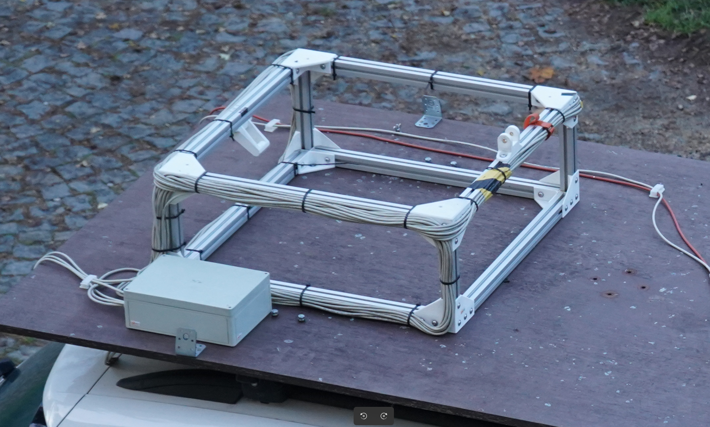
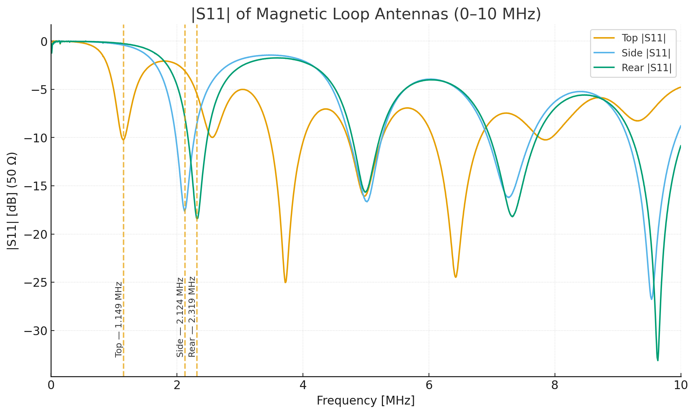
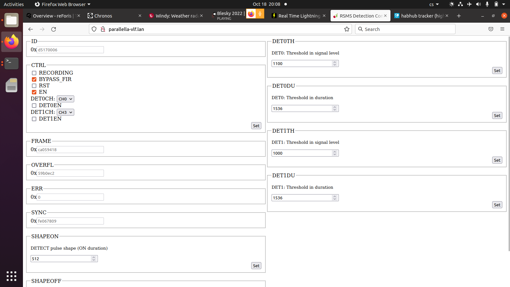
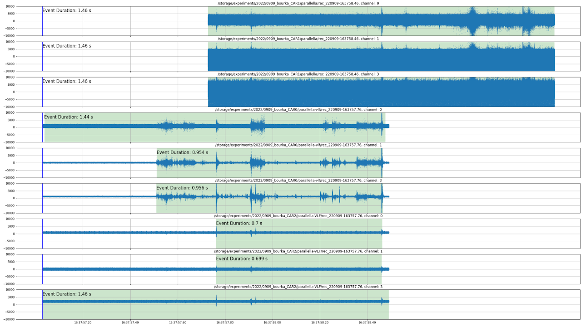

# RSMS02 – VLF Radio Storm Monitoring Station

RSMS02 is a Very Low Frequency (VLF) lightning mapping station designed for detection, recording, and triggering of lightning-related electromagnetic signals. It serves as the low-frequency counterpart to [RSMS01](/RSMS01/), generating triggers for simultaneous UHF recording and enabling synchronized multi-band observation of atmospheric electrical activity.

## Functional Overview

The station uses a three-axis loop antenna array to capture the magnetic component of VLF emissions from lightning discharges. The loops can be deployed either on a stationary platform or mounted on a vehicle roof for mobile campaigns. Each loop feeds a high-speed digitizer implemented on the [ADCoctoSPI01](https://www.mlab.cz/module/ADCoctoSPI01/) MLAB module, which provides low-noise analog front-end amplification, variable gain control, and high-resolution conversion. The station’s embedded processing unit manages data capture, triggering, and network communication.

The RSMS02 station continuously monitors the VLF spectrum and identifies events using an energy-based algorithm implemented in FPGA logic. When a threshold is exceeded for a defined duration, a TTL trigger pulse is issued to the connected instruments, such as RSMS01 or high-speed optical systems. The triggering mechanism ensures that even short-duration lightning impulses are captured while minimizing false positives from narrowband interference.

## VLF Antenna Array

The RSMS02 antenna is built from three orthogonal magnetic loops mounted on a rigid 40 mm aluminum-profile frame, with 3D-printed corner isolators that decouple the loops from the supporting structure. Each loop is wound from a 10 m length of STP (shielded twisted pair) cable based on the [VLFANT01 module](https://www.mlab.cz/module/VLFANT01/). The same antenna geometry is used in both vehicle-roof and stationary deployments, which keeps calibration and signal processing identical across mobile and fixed campaigns.

Because the loops are deliberately operated below their self-resonance for broadband impulse reception, the practically useful bandwidth ends at the first reflection minimum of each loop. The small-signal input reflection |S₁₁| (50 Ω reference) was measured with a calibrated VNA between 10 kHz and 10 MHz, and the first dips for the three loops appear at:

| Loop  | First reflection minimum |
|-------|--------------------------|
| Top   | 1.149 MHz                |
| Side  | 2.124 MHz                |
| Rear  | 2.319 MHz                |

These minima mark the onset of self-resonant behavior — for broadband lightning-pulse reception the antenna behaves as an electrically short magnetic dipole below the first dip, so the useful operating region for VLF lightning observation is roughly **100 kHz up to ≈ 1 MHz** for all three loops.

## Lightning Trigger

The FPGA implements a configurable threshold-and-duration trigger rather than a simple amplitude detector. Detection requires that the absolute sample value exceeds a programmable threshold for a programmable minimum number of consecutive samples — equivalent to a *Time-over-Threshold* (ToT) test. This is a fast hardware approximation of an energy detector

$$E = \int_{t_1}^{t_2} |s(t)|^2 \, dt \;>\; E_\mathrm{th},$$

which is necessary because the lightning waveform is intrinsically random and no matched filter applies. The required-number-of-consecutive-samples constraint suppresses isolated noise spikes that would falsely trigger a pure amplitude detector, while at the same time avoiding the cost of squaring and accumulating samples in real time.

The trigger is configured directly from the web-based UI of the receiver:

Two independent trigger channels are available, each fully programmable:

| Parameter             | Description                                                |
|-----------------------|------------------------------------------------------------|
| Trigger detectors     | 2 independent channels (Trigger 0, Trigger 1)              |
| Enable bits           | Separate enable per channel (bit 16 / bit 20)              |
| Channel selection     | Selectable ADC channel (0–7) per trigger                   |
| Threshold             | 16-bit unsigned, compared against `abs(sample)`            |
| Duration              | Minimum consecutive samples above threshold                |
| Shape-on time         | Trigger pulse duration (0–65 535 cycles)                   |
| Shape-off time        | Dead time before next trigger can fire                     |

Typical operator settings during mobile thunderstorm observation are 10–30 mV on the threshold and 5–20 µs on the duration, set per channel based on local noise conditions. The trigger output is propagated as a TTL pulse to external instruments (RSMS01 UHF receiver, high-speed cameras, EFM data logger). The Verilog implementation of the `threshold_detector` module is included in the receiver firmware repository.

## Technical Parameters

| Parameter                           | Typical value / range              | Notes                                 |
| ----------------------------------- | ---------------------------------- | ------------------------------------- |
| **Sampling rate (per channel)**     | 10 MSPS                            | 12-bit resolution                     |
| **Number of channels**              | 3 (orthogonal loops)               | Measures X, Y, Z magnetic components  |
| **Timing source**     | PPS                   | From external GNSS receiver   |
| **Timestamp precision**             | 100 ns                             | GNSS-disciplined clock                |
| **Pre-trigger capture**             | Supported                          | Configurable window length            |
| **Trigger output**                  | TTL compatible                     | Adjustable level and width            |
| **On-board computer**                | Zynq XC7Z01 SoC + Epiphany E16G301 | ARM + parallel coprocessor            |
| **Operating system**                | Linux (Ubuntu)                     | Web and CLI control interface         |
| **RAM / Storage**                   | 1 GB / microSD (typ. 16 GB)        | Data and configuration files          |
| **Network interface**               | 1 Gbit Ethernet                    | Data offload and remote control       |
| **Power input**                     | 9–14.8 V DC                        | Vehicle-compatible                    |
| **Preview latency**                 | ~2 s                               | Depends on configuration              |
| **THD (Total Harmonic Distortion)** | ≈ −65 dBFS                         | Typical at 1 MHz input                |
| **Signal-to-Noise and Distortion Ratio  (SINAD)**                           | ≈ 63 dB                         | Optimal signal conditions       |
| **Input impedance**                 | ≈ 5 kΩ                             | Differential, ~2 pF input capacitance |
| **Input referred noise**            | ≈ 5.5 nV/√Hz                       | At VGA gain = 31 dB                   |
| **VGA gain range**                  | −5 dB to +31 dB                    | Step size 0.125/1 dB                  |

## Front-End and Digitizer

The digitizer module [ADCoctoSPI01](https://www.mlab.cz/module/ADCoctoSPI01/) integrates an eight-channel TI AFE5801 chip, providing variable gain amplifiers and 12-bit ADCs with LVDS output. In RSMS02, three of these channels are used for the orthogonal loop antennas. The analog front-end features fine (0.125 dB) and coarse (1 dB) gain steps, ensuring accurate signal scaling over a wide dynamic range. Signal linearity and low noise make the system suitable for quantitative analysis of electromagnetic field intensity and waveform structure.

To minimize interference, the antenna shields follow a star-ground topology, and the loop outputs are galvanically isolated from the chassis. Each channel maintains consistent phase characteristics for accurate vector reconstruction of lightning directionality.

## System Operation

During operation, the station continuously monitors the incoming magnetic field signals. When the energy content within the configured time window exceeds the threshold, the event is stored locally, and a trigger is propagated to auxiliary devices. Operators can monitor signal levels, trigger thresholds, and data capture via a web-based interface or command-line tools. Data files include binary waveform streams with sidecar metadata that describe timestamping, gain settings, and antenna configuration.

For field deployment, the loop array can be mounted orthogonally on a lightweight frame attached to the roof of a measurement vehicle or on a fixed building. The electronics enclosure is weather-protected, and the system can be powered directly from the vehicle’s DC bus.

## Data Format

Each recording contains:

* Three-channel VLF waveform data (12-bit, 10 MS/s)
* PPS timestamps and internal counters
* Configuration metadata (gain, trigger settings, decimation)

These files can be analyzed using post-processing tools for event classification, correlation with UHF data from RSMS01, or temporal matching with optical and radiation sensors.

An example of a triggered event simultaneously captured by three measuring cars (each carrying a 3-axis loop array) is shown below. The mutual delay between cars is caused by them triggering on different signatures within the same flash, which complicates capturing the entire event in a single shared time window:

## Data Processing and Distributed Lightning Mapping

With a minimum of three RSMS02 stations, it is already possible to reconstruct the location of a lightning discharge using time‑of‑arrival processing of VLF waveforms. An example of such a reconstruction is shown below:

This first‑generation map demonstrates the feasibility of locating lightning sources using synchronized VLF recordings. However, the system is designed to enable far more advanced processing. Unlike traditional lightning‑location networks that rely on centralized servers, RSMS02 stations are built as **software‑defined radio receivers with sufficient on‑board compute power** to participate directly in the processing pipeline.

Because both signal bandwidth and required computation scale rapidly with the number of stations, the architecture is intentionally distributed. Individual waveform fragments can be exchanged between stations in the network, allowing cooperative processing and load balancing. Stations that are not in direct range of the event may still contribute their unused compute capacity to perform localization tasks for events recorded elsewhere.

This approach has two main advantages:

1. It keeps the full waveform data accessible to researchers, enabling open and verifiable scientific use rather than a black‑box location service.
2. It removes the scalability limits that affect centralized networks such as Blitzortung.org or similar, where both data bandwidth and compute requirements grow faster than the infrastructure can support.

The long‑term goal is a completely open, peer‑to‑peer lightning mapping network, where any properly synchronized UST's RSMS station can contribute raw waveforms, participate in distributed processing, or run localization and mapping algorithms.

## Related Publications

* [In situ ground-based mobile measurement of lightning events above central Europe](https://amt.copernicus.org/articles/16/547/2023/)

