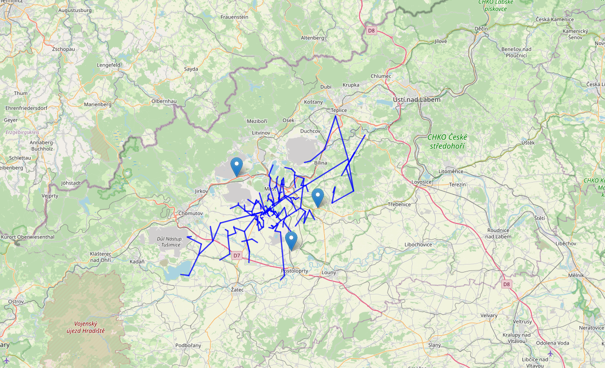

# Segment-based visualization for VLF lightning mapping

When a network of three or more RSMS02 stations records the same flash, the recordings can be combined to reconstruct an approximate spatial structure of the lightning discharge. Because individual flashes commonly span tens of kilometers horizontally and last hundreds of milliseconds — far longer and far more extended than the single, short return-stroke pulse most lightning networks publish as a point on a map — the resulting map is built from many short signal segments rather than from a single localized point per event.

The visualization above uses VLF data from three measuring stations placed on cars. It is intentionally illustrative: it projects the lightning channels onto a 2D plane at a fixed assumed cloud-base altitude. Despite the simplification it is a closer description of the physical reality of a lightning discharge than the usual single-point representation, which intuitively suggests a CG strike at the marked location even though most network detections actually correspond to CC discharges.

The algorithm operates in five steps. A reference Jupyter notebook implementation is available [here](https://github.com/ODZ-UJF-AV-CR/CRREAT_cars/blob/master/VLF_lightning/VLF_location.ipynb).

## 1. Signal preprocessing and segmentation

Recordings from each station are aligned according to absolute timestamps reconstructed from the GNSS PPS pulse and the ADC sample counter. Each raw signal $s_i(t)$ is then normalized to zero mean and unit variance, and slow offsets are removed.

The prepared waveforms are split into a number of contiguous segments $S_k$, chosen so that each segment carries comparable total energy $E_k$ — calibrated against the weakest of the simultaneous recordings:

$$E_k = \int_{S_k} |s_i(t)|^2 \, dt , \qquad E_k \approx E_\mathrm{min}.$$

This avoids the algorithm being dominated by the loudest station and gives even faint, distant stations a chance to contribute to the reconstruction.

## 2. Cross-correlation and time-difference of arrival

For every segment, the cross-correlation between signals from stations $i$ and $j$ is

$$R_{ij}(\tau) = \int s_i(t)\,s_j(t+\tau)\,dt ,$$

and the time offset at the correlation peak is taken as the inter-station delay

$$\Delta t_{ij} = \arg\max_{\tau} R_{ij}(\tau).$$

With one reference station 1, the per-station delays reduce to $\Delta t_i = t_i - t_1$. Physically impossible solutions (delays larger than the speed-of-light travel time between stations) are rejected with

$$|c\, \Delta t_i| < \lVert \mathbf{r}_i - \mathbf{r}_1 \rVert.$$

## 3. Numerical localization

The source position $\mathbf{r}=(x,y)$ satisfies, for each station pair,

$$\sqrt{(x-x_i)^2 + (y-y_i)^2} - \sqrt{(x-x_1)^2 + (y-y_1)^2} = c\, \Delta t_i.$$

The estimate $\hat{\mathbf{r}}$ is obtained by minimizing the sum of squared residuals of this system over all participating stations. In the simplified 2D visualization, the full 3D least-squares solution is projected onto a plane at the expected cloud-base altitude.

## 4. Bearing-line visualization

When a station records two orthogonal field components, the instantaneous azimuth of arrival is

$$\alpha_i = \mathrm{atan2}\bigl(E_y(t_i),\, E_x(t_i)\bigr),$$

with corresponding unit direction vector $\mathbf{d}_i = (\cos\alpha_i, \sin\alpha_i)$. Instead of plotting localized points, each receiver is drawn as a short bearing line

$$\mathbf{r}(s) = \mathbf{r}_i + s\,\mathbf{d}_i,\qquad 0 \le s \le L,$$

for a few tens of kilometers of map scale. The ensemble of such segments represents the instantaneous spatial organization of the lightning current system, rather than a set of isolated point impacts.

## 5. Graph-based structural visualization

The bearing lines are then turned into an approximate channel-like structure by graph construction.

Candidate spatial points $\mathbf{p}_m$ are obtained either as
1. intersections of two bearing lines from different stations, or
2. extrapolated continuation points along a single bearing line for which the corresponding segment carries enough energy.

A pairwise intersection $\mathbf{p}_{ij}$ of stations $i$ and $j$ comes from solving $\mathbf{r}_i + s_i\,\mathbf{d}_i = \mathbf{r}_j + s_j\,\mathbf{d}_j$ with $0 \le s_i, s_j \le L$.

The visualization graph $G=(V,E)$ is then

$$V = \{\mathbf{p}_m\},\qquad E = \bigl\{(\mathbf{p}_a, \mathbf{p}_b) :\, \lVert \mathbf{p}_a - \mathbf{p}_b \rVert < d_\mathrm{max},\; |t_a - t_b| < \Delta t_\mathrm{max}\bigr\},$$

where $t_m$ is the timestamp of the signal segment that produced $\mathbf{p}_m$. The spatial proximity condition keeps the algorithm from connecting unrelated channel fragments, while the temporal adjacency condition enforces causal ordering along the discharge.

The final drawn structure is the union of all selected edges:

$$\Gamma = \bigcup_{(\mathbf{p}_a, \mathbf{p}_b)\in E} \{\mathbf{p}_a + u(\mathbf{p}_b - \mathbf{p}_a) :\, 0\le u \le 1\}.$$

Two practical properties of this representation are:

* **Topological continuity** of the discharge is preserved — there is no clustering step that would collapse a lightning channel into an isolated point.
* **Spurious bearings are suppressed**: an isolated noisy line that has no compatible intersection in space and time simply does not generate any edge in $E$, so it disappears from the final map.

## Why this matters

Most public lightning networks (Blitzortung.org, WWLLN, LINET, Vaisala) reduce a flash to one point per detected pulse, optimized for a centralized server pipeline. The RSMS02 architecture instead keeps the raw waveform on every station and supports cooperative processing. With three or more synchronized RSMS02 stations the full structural visualization shown above becomes possible without requiring a central server — a step toward a peer-to-peer lightning mapping network where any properly synchronized station can contribute raw data, processing, or both.

## Related publications

* J. Kákona et al., [_In situ ground-based mobile measurement of lightning events above central Europe_](https://doi.org/10.5194/amt-16-547-2023), Atmos. Meas. Tech. 16, 547–561, 2023.
* J. Kákona, [_Detection of Electromagnetic Phenomena in the Atmosphere – Integrating Advanced Instrumentation and UAVs for Enhanced Atmospheric Research_](https://dspace.cvut.cz/handle/10467/120570), doctoral thesis, CTU in Prague, 2025.
