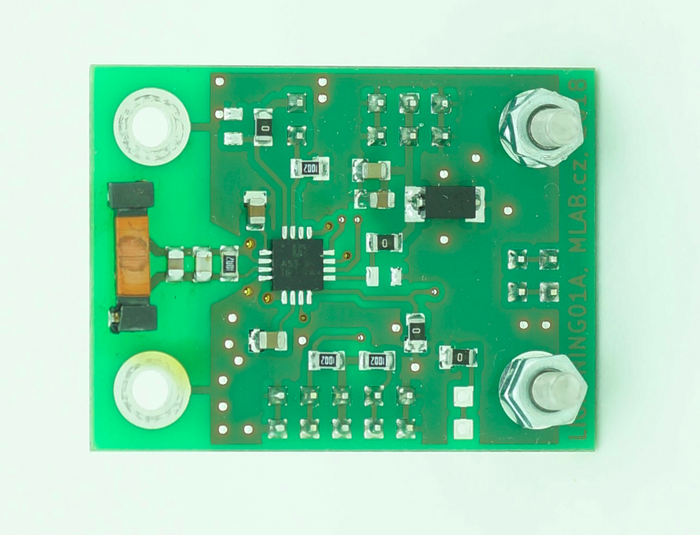
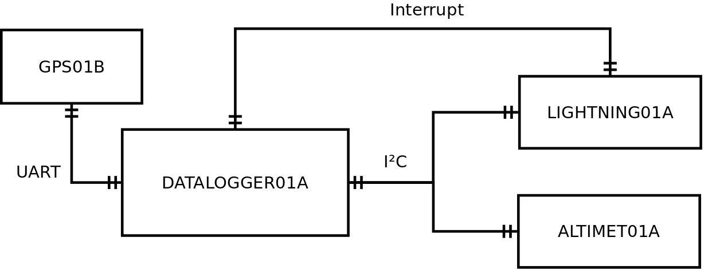
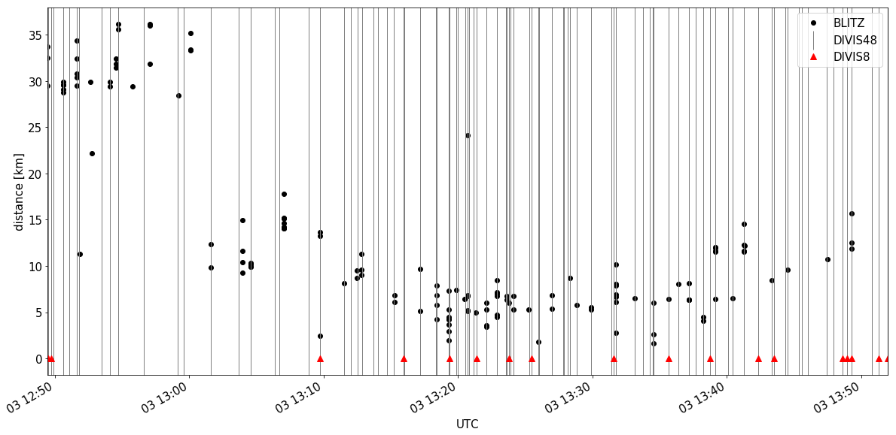
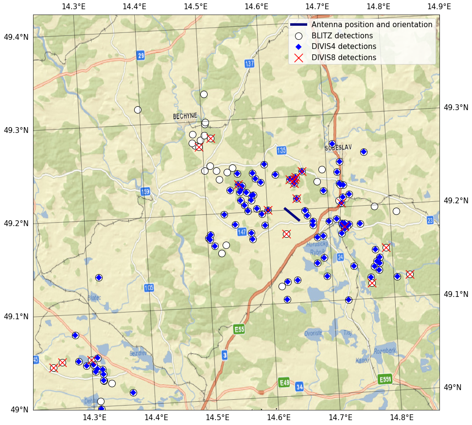

# Data recording triggered by lightning

A reliable trigger is the cornerstone of every event-driven lightning observation system. Recording the full waveform of a thunderstorm is technically infeasible: a single SDR receiver at 10 MS/s on multiple channels produces data faster than it can be written to storage, and the latency of flushing a captured fragment to disk creates **dead time** during which no further event can be acquired. The trigger therefore decides both *what* and *when* the instrument records.

This page documents the trigger methods that the [RSMS systems](/RSMS/) use and replace, together with the measurements that motivated the final design.

## Trigger requirements

For research-grade lightning observation in the field, a trigger has to combine several properties:

* High true-positive rate even in electromagnetically noisy environments (highways, urban areas, switching power supplies on the measurement vehicle).
* Low false-positive rate, because every false trigger wastes the dead time window.
* Operation in stand-alone mode (no network connection required, no central server).
* Mobile deployment (low power, vibration tolerance, fast warm-up).
* Output suitable for distribution to several downstream instruments (cameras, EFM logger, radiation detectors).

These constraints rule out the most widely used signal-amplitude threshold (too many false positives in noisy environments) and at the same time the most physically accurate matched-filter detector (lightning waveforms are time–space random, so no usable template exists). The practical compromise is an energy-based detector.

## Energy-based detection

For a signal $s(t)$ on the interval $[t_1, t_2]$, the signal energy is

$$E = \int_{t_1}^{t_2} |s(t)|^2 \, dt ,$$

and an event is declared whenever $E > E_\mathrm{th}$. In discrete time with sample period $\Delta t$, this becomes

$$\sum_{0 \le i < N} |s(t_1 + i\Delta t)|^2 \Delta t > E_\mathrm{th}.$$

The [RSMS02 receiver](/RSMS02/) uses a hardware-friendly approximation: count the number of consecutive samples whose absolute value exceeds an amplitude threshold $A_\mathrm{th}$, and trigger when this count reaches $N_\mathrm{min}$:

$$\forall i,\, 0 \le i < N_\mathrm{min}\!:\; |s(t_1 + i\Delta t)| > A_\mathrm{th}.$$

This is a Time-over-Threshold (ToT) detector. It is a lower bound on the energy detector, since

$$\sum_{0 \le i < N_\mathrm{min}} |s(t_1 + i\Delta t)|^2 \Delta t \;\ge\; N_\mathrm{min} A_\mathrm{th}^2 \Delta t .$$

Compared with a pure amplitude threshold, the ToT version is robust against isolated noise spikes. Compared with a full energy detector, it is far cheaper to implement: the FPGA only needs a comparator and a counter, no multiplications. The RSMS02 firmware implements this trigger directly in VHDL — see the `threshold_detector` module in the receiver firmware repository.

The exposed configuration parameters are: ADC channel selection, amplitude threshold (16-bit unsigned), minimum duration (in samples), trigger pulse shape (on/off times for downstream instrument compatibility). Two independent trigger channels run in parallel so a single station can produce two triggers with different selectivity (e.g. one tuned for nearby lightning, one for distant flashes).

## Why not a commercial chip?

Before adopting the SDR-based approach, the AMS [AS3935](https://ams-osram.com/products/sensors/position-sensors-and-switches/ams-as3935-franklin-lightning-sensor) integrated lightning sensor was evaluated as a candidate trigger source. The AS3935 implements a proprietary internal classification algorithm and a tuned 500 kHz coreless coil antenna ([MA5532-AE](https://ams-osram.com/products/sensors/position-sensors-and-switches/ams-as3935-franklin-lightning-sensor)). The chip outputs one of three classifications per event: lightning (`DIVIS8`), disturbance (`DIVIS4`), or high-noise (`1`).

The MLAB module [LIGHTNING01A](https://github.com/MLAB-project/LIGHTNING01A) carries this circuit:

The complete data logger built around LIGHTNING01A (with a [DATALOGGER01A](https://www.mlab.cz/module/DATALOGGER01A/), GPS receiver, pressure sensor, primary lithium-thionyl-chloride cell) is shown below:

The instrument is mobile (operates from a single LS33600 cell for ≈5 days with GPS on, ~3 months without GPS), low-mass, and trivial to integrate. The relevant question is whether its proprietary classification can be used as a research-grade trigger.

### Comparison with Blitzortung.org

The LIGHTNING01A was field-tested side-by-side with the Blitzortung.org network across multiple thunderstorms in Czechia. Coincidences between LIGHTNING01A detections and Blitzortung-localized strikes within radii of 5, 10, 20 and 30 km were counted within a ±1.5 s window:

The map below shows Blitzortung detections together with the subset that also coincides with a LIGHTNING01A event (blue = `DIVIS4`/disturbance, red = `DIVIS8`/lightning):

Findings:

* LIGHTNING01A (`DIVIS48`, both classifications combined) **covered 94.7 % of Blitzortung strikes within 5 km** of the station, and ≈ 79 % within 30 km.
* The proprietary lightning-vs-disturbance classification is **not reliable**: only 36.8 % of Blitzortung-confirmed lightning was classified as lightning (`DIVIS8`) by the chip. For trigger purposes, the `DIVIS4`+`DIVIS8` combination is therefore mandatory.
* Approximately 43 % of `DIVIS4` events are not registered by Blitzortung within 30 km — those are either real but beyond range, or false positives. With the `DIVIS4`+`DIVIS8` combination the false-positive rate is too high to be used standalone to gate the recording of high-rate instruments.
* The latency from a rectangular test signal injected into the coil to the interrupt output is 93 ms ± 1 ms when classified as a disturbance; pulses classified as lightning emerge in only a few ms. This non-deterministic latency cannot be characterized further because the algorithm is closed-source.

### When LIGHTNING01A is useful

The above caveats notwithstanding, LIGHTNING01A is useful for triggering bulk instruments that

1. record long, contiguous fragments (≥ 1 s before and after the trigger), and
2. tolerate substantial false-positive rates.

Typical applications: airborne dosimeters that need a coarse "thunderstorm proximity" flag, long-window data loggers, screening tools for picking storm-time intervals out of a multi-day archive. For high-speed cameras and SDR receivers, where the per-event dead time is many seconds, the false-positive rate of an AS3935 is unacceptable and a ToT detector inside the SDR (RSMS02) is the correct solution.

The directional sensitivity of the small coil antenna is slight but measurable — typically a factor 2 between the broadside and end-fire directions, observed in the spatial distribution of coincident strikes. For close lightning within a 5 km radius the effect is negligible.

## Practical recipe for users

* **In-storm SDR triggering** (RSMS02 + camera, EFM, radiation detectors on the same vehicle): use the RSMS02 ToT trigger directly. Typical settings: threshold 10–30 mV, duration 5–20 µs, both adjustable from the web UI per channel.
* **Coarse storm-flag logger** (battery-operated, long deployment, no SDR available): use a LIGHTNING01A-based DIVISEK box; treat its `DIVIS4`+`DIVIS8` outputs as a single combined detection and expect some false positives.
* **Reference / cross-check**: pull the Blitzortung.org server feed in parallel with whatever local trigger you use. Differences in coverage between the two are *informative* — they tell you when your local sensitivity is mistuned.

## Related publications

* J. Kákona et al., [_In situ ground-based mobile measurement of lightning events above central Europe_](https://doi.org/10.5194/amt-16-547-2023), Atmos. Meas. Tech. 16, 547–561, 2023.
* J. Kákona, [_Detection of Electromagnetic Phenomena in the Atmosphere – Integrating Advanced Instrumentation and UAVs for Enhanced Atmospheric Research_](https://dspace.cvut.cz/handle/10467/120570), doctoral thesis, CTU in Prague, 2025.
