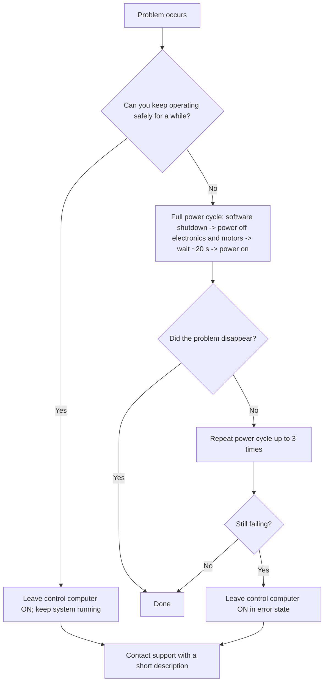

# Troubleshooting

## Calibration Issues

If the mount calibration reaches the edge of its working range (that condition could be caused by various issues such as interrupted calibration or failure to detect the range limit). To resolve this problem, follow these steps:

1. On the remote controller, press the `Center` button. This action tells the control system that the mount is at the center of its range.
2. Using the RA and DEC movement buttons, manually adjust the mount to the actual center. Repeat this process as needed, as a single press of the `Center` button may not be sufficient.
3. Once the mount is centered, it is highly recommended to restart the calibration process and visually verify the procedure.

## Time Axis Not Rotating

If the time axis does not rotate:

1. Try enabling the time axis using the remote controller. If this does not work, use the web interface to enable it.
2. Check that the start button in the web interface is highlighted green, indicating it is active.
3. Navigate to the `Mount >> Motor Time` section in the interface and ensure the `SPEED` value is non-zero and the `POSITION` parameter is changing.
4. Manually verify that the motor axis driving the time axis can rotate freely. If the resistance is minimal, proceed with the troubleshooting steps under "Other Problems." If there is significant resistance, the issue may be mechanical.

## Incorrect Time Axis Speed

The speed of the time axis can be adjusted through the web interface:

1. In the `Mount` section, locate the settings button at the bottom.
2. Click on it to open a window with two numerical fields. Enter the absolute speed value and click `Save` to apply the changes.
3. Enable the time axis to check the current speed and find the `SPEED` parameter in the `Motor Time` driver settings menu.

## Other Problems

If the issue persists after multiple restarts, **leave the control computer powered ON in the error state** and contact the support team at [support@ust.cz](mailto:support@ust.cz) or +420 601 587 416. Include a concise description of the problem to speed up resolution.

**Power‑cycle steps**

1. Use the software power switch to shut down the control computer and wait for the LED indicators to turn off.
2. Disconnect power to the electronics and motors.
3. Wait approximately 20 seconds, then restart the system as described in the main manual.

