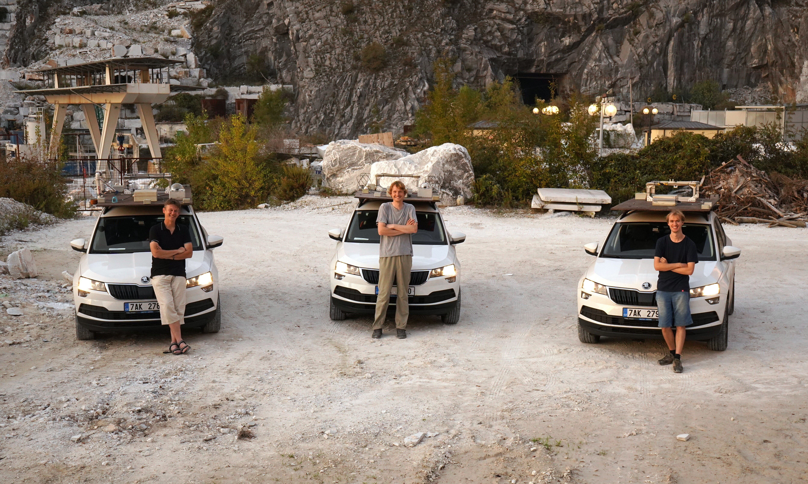
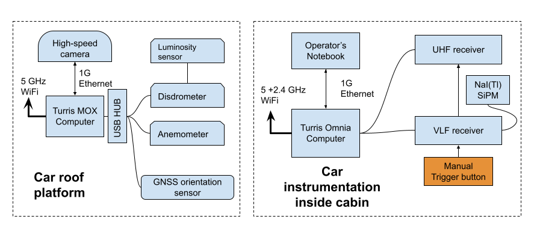
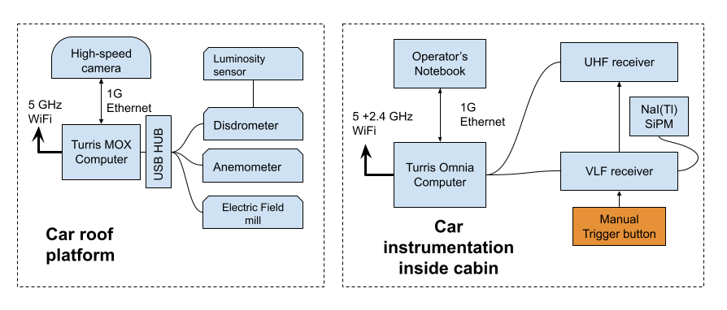
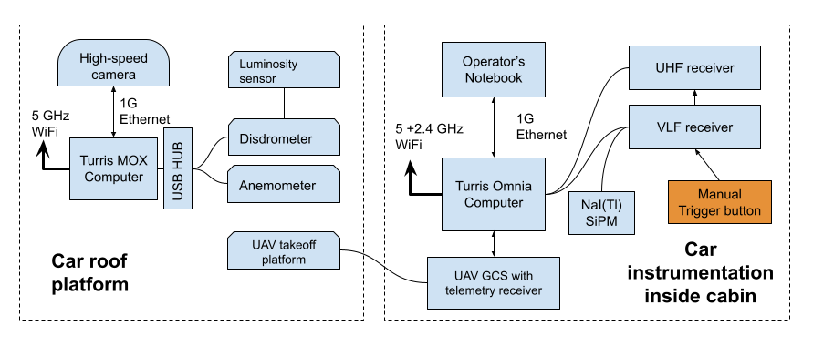
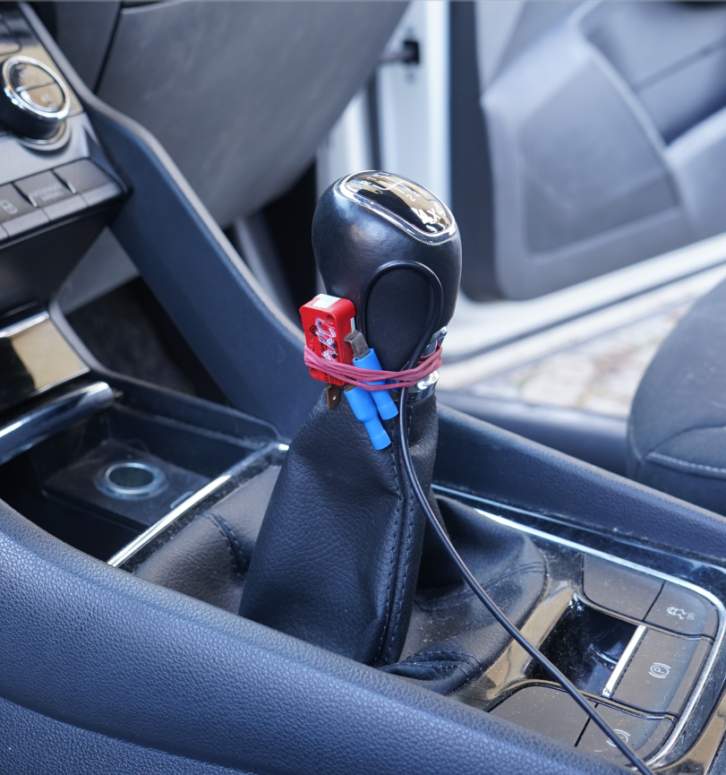
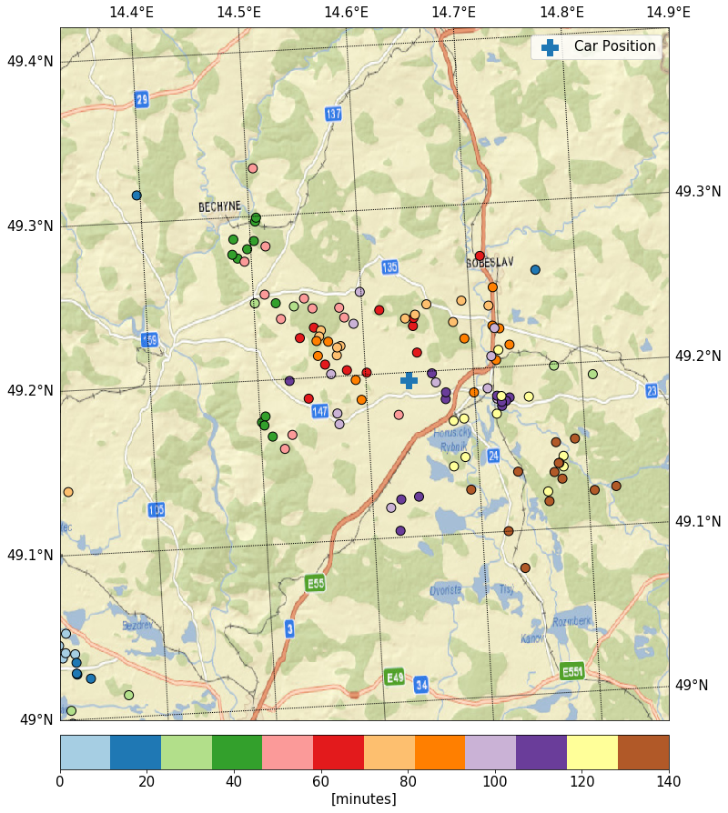
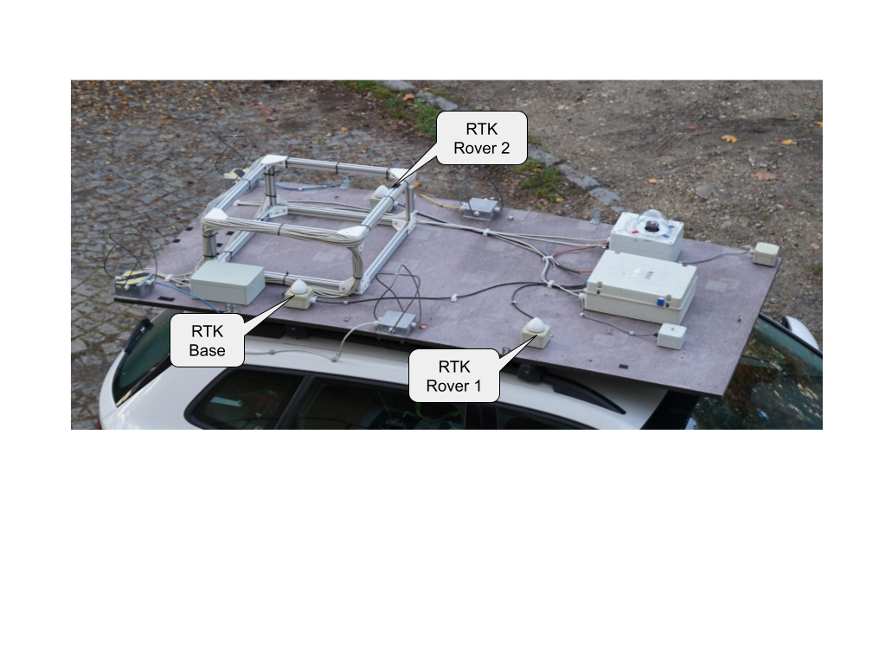

# Storm measurement vehicles

A storm measurement vehicle is an integrated mobile platform for in-field observation of thunderstorms. UST's car-based measurement system combines the full UST instrumentation chain on a non-conductive roof platform with in-cabin servers, radios, and operator interfaces — turning each car into one node of a coordinated multi-station scientific network that can be re-positioned in minutes around an active thunderstorm cell.

The platform was first deployed as a three-car network during the [CRREAT project](https://crreat.eu/) at the Nuclear Physics Institute of the Czech Academy of Sciences, where the hardware was co-developed by UST. It is now offered as a general-purpose, instrument-agnostic platform — the same design can carry any mix of UST radio receivers, electric-field mills, ionizing-radiation detectors, optical sensors, and meteorological instruments.

## Why a mobile platform?

A high-mountain or rooftop observatory has predictable geometry — but it cannot move to where the storm actually develops. A purely satellite-based or fixed-network observation has no in-situ measurements at all. The mobile car platform combines both: each storm cell is intercepted from below or from beside it, with the full suite of instruments deployable within minutes of a parking decision.

Typical operational pattern:

1. Long-term and short-term weather forecasts identify a candidate day.
2. ECMWF model runs identify a candidate region.
3. On the day of the campaign, satellite imagery (Cb formation) and weather-radar data narrow the location down to a specific motorway corridor.
4. Three or more cars are dispatched to non-collinear positions around the predicted storm core to allow TDoA reconstruction.
5. Once parked, each car switches from manual driving mode to a stationary measurement mode that requires extended dwell (radiation detectors in particular need pre- and post-storm baselines).

Average single-storm dwell time at a good observation site is about **half an hour**, which is small enough that any instrument failure on any of the cars usually means losing the entire event — so reliability of the system as a whole, not just any single instrument, is the binding constraint.

## A networked, role-specialised fleet

Several cars in the same campaign share most of the instrumentation but differ deliberately in some elements so that the network as a whole covers all the bands required for a multi-band thunderstorm description. The three roles described below are the variants that proved themselves during the CRREAT deployments; other role combinations are possible on the same platform.

### Variant A — UHF + VLF baseline car

The baseline car carries the [RSMS01](/RSMS01/) UHF receiver with the full four-element QFH antenna array, plus the [RSMS02](/RSMS02/) VLF receiver, an [all-sky high-speed camera](#high-speed-all-sky-camera), and a GNSS orientation tracking system. This is the reference "lightning instrument" car. Its roof platform with the QFH antenna array is shown below:

### Variant B — E-field car

The E-field car carries an electric-field mill (originally the Kleinwächter EFM 115 and later [THUNDERMILL01](/THUNDERMILL/THUNDERMILL01/)), plus a long-window storage oscilloscope that was used in the early campaigns as a primary trigger source — see the [Lightning triggering](/RSMS/lightning-trigger/) page for the history of that approach and why it was eventually replaced by a ToT trigger inside the [RSMS02 FPGA](/RSMS02/).

### Variant C — autogyro carrier

The autogyro carrier extends the same baseline with an in-cabin **ground control station and a roof launch platform for the [TF-G2 unmanned autogyro](https://docs.thunderfly.cz/instruments/TF-G2)**. The autogyro is car-launched directly from the platform: the rotor is mechanically locked in an inclined launch position and pre-spun via a weights-and-pulley mechanism inside the platform tubes; once the car reaches a few m/s forward speed the platform unlocks the rotor, autorotation takes over, and the autogyro becomes airborne within tens of meters. Onboard the autogyro: [THUNDERMILL01 in the rotor head](/THUNDERMILL/THUNDERMILL01/#uav-deployment--autogyro-rotor-head), AIRDOS03 (UAVDOS) ionizing radiation detector, [TF-ATMON](https://docs.thunderfly.cz/instruments/TF-ATMON) telemetry.

## Common instrumentation

### Triggering and recording

A working storm-time trigger is the single most important component of the system, because every false trigger consumes seconds-to-minutes of write-to-disk dead time during which no further event can be captured. The trigger architecture used in storm cars evolved through three generations:

1. **Storage oscilloscope** with a manually configured threshold-and-pulse-length trigger. Effective but high-maintenance; each storm required re-tuning, and storage-write times of several minutes per event were the dominant dead-time source.
2. **AS3935-based [LIGHTNING01A](/RSMS/lightning-trigger/)** off-the-shelf detector, with all detections recorded and compared against Blitzortung.org as ground truth. Useful for triggering long-window bulk instruments but not for sub-second SDR or high-speed-camera triggering due to non-deterministic algorithm latency and a too-high false-positive rate.
3. **In-FPGA ToT trigger inside [RSMS02](/RSMS02/#lightning-trigger)** — the current production solution.

Each generation kept a **manual trigger button on the gear lever** as a backup, so the operator could fire the recording manually when a visible lightning event happened but the automatic trigger had not yet caught up to the storm's parameters.

### Lightning network ground truth

For algorithm validation and post-campaign analysis, the LIGHTNING01A detections were compared against Blitzortung.org over the same time window. Lightning positions over the duration of a typical observation are shown below; the cross is the parked car:

### High-speed all-sky camera

Each camera-equipped car carries a Chronos 1.4 high-speed all-sky camera (LUX1310 CMOS, 928×928 px, 1612 FPS) inside a SolidBox 69200 enclosure with a Duradom 200 mm plexiglass dome and an IR-blocking filter. The shutter is set between 4.9 and 34 µs in daytime and up to 614.6 µs at night. The camera typically saves a 2–3 s window per event, in either H.264 or 12-bit raw.

### Vehicle timing and positioning

The cars need accurate absolute time for cross-correlation between cars and across instruments. Time discipline is provided by a [Turris Omnia](https://www.turris.com/en/) onboard router fed by a dedicated GNSS receiver — the router then serves NTP/PTP to all on-board instruments over the in-car Ethernet. This replaced an earlier setup based on `ntp-wait` over LTE, which suffered from unreliable LTE coverage during the actual storms and from very long initial-sync times.

Positioning was also iterated several times:

1. A single GNSS receiver for coordinates plus a manually targeted compass for car heading — imprecise and operator-intensive.
2. **Three [MLAB GPS02 modules](https://www.mlab.cz/module/GPS02/)** with uBlox NEO-M8P receivers in a moving-baseline RTK configuration on the roof platform.

The RTK moving-baseline solution gives very high positioning accuracy when the GNSS signal phase is uninterrupted, but coverage gaps under bridges and tree canopies regularly invalidate the solution. The receiver does not reliably flag invalid moving-baseline output, so the solution is supplemented with the magnetometer-based heading from [WINDGAUGE03](/WINDGAUGE/) for redundancy.

### Communication between cars

PMR radios proved insufficient — they did not support a coordinator role and were impractical for the driver. The current setup uses **HabHub** technology (initially developed for stratospheric balloon tracking) for vehicle position sharing on a unified web map, plus **Jitsi** for voice. Each car shares its position in real time, so the team can re-position the network geometrically as the storm develops.

## Auxiliary instruments

Each car carries the same set of auxiliary instruments to provide the context required to interpret the primary measurements:

* **[DISDROMETER01](/DISDROMETER/)** — piezoelectric disdrometer, used to rule out radon-progeny washout in the radiation data and to record the hydrometeor sequence.
* **[WINDGAUGE03](/WINDGAUGE/)** — storm-resistant Venturi anemometer with absolute bearing.
* **Temperature and pressure** — [ALTIMET01A](https://www.mlab.cz/module/ALTIMET01A/) MLAB module on every car, used to compensate temperature-dependent variations in the scintillation radiation detectors.
* **Ionizing radiation** — combination of scintillation (GEODOS-class) and silicon PIN (SPACEDOS-class) detectors, see [docs.dos.ust.cz](https://docs.dos.ust.cz).

## Deployments

* **[CRREAT project](https://crreat.eu/) (Czechia)** — three-car network operated jointly with the Nuclear Physics Institute of the Czech Academy of Sciences from 2018 onwards. First and most extensive deployment of the platform; the publications below describe its results.

## Related publications

* J. Kákona et al., [_In situ ground-based mobile measurement of lightning events above central Europe_](https://doi.org/10.5194/amt-16-547-2023), Atmos. Meas. Tech. 16, 547–561, 2023.
* J. Kákona, [_Detection of Electromagnetic Phenomena in the Atmosphere – Integrating Advanced Instrumentation and UAVs for Enhanced Atmospheric Research_](https://dspace.cvut.cz/handle/10467/120570), doctoral thesis, CTU in Prague, 2025.
