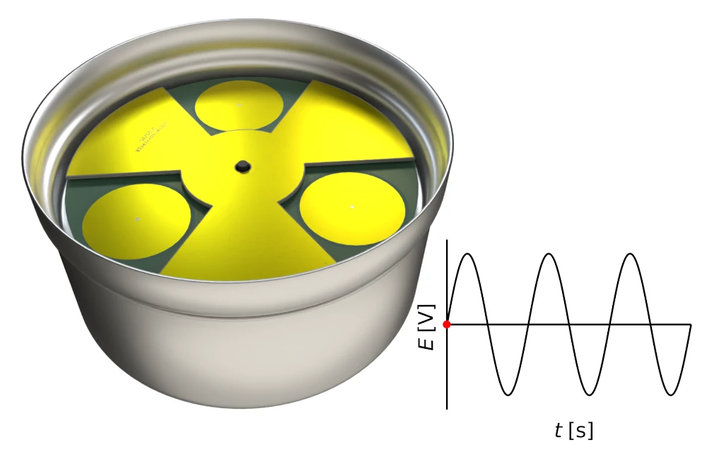
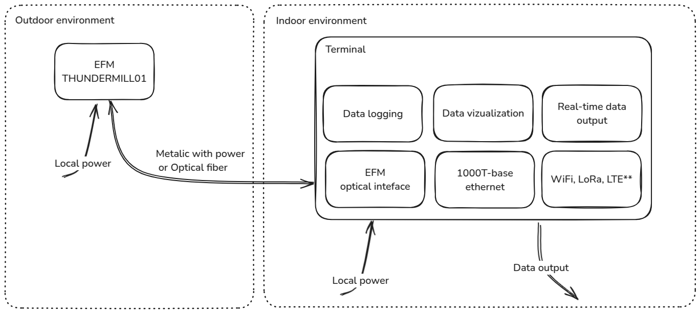
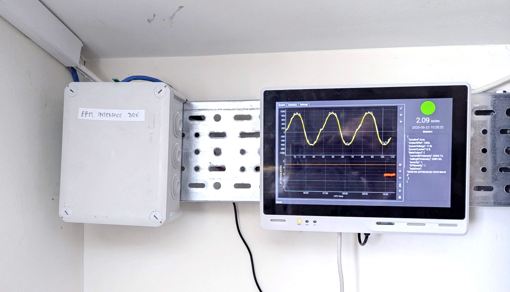
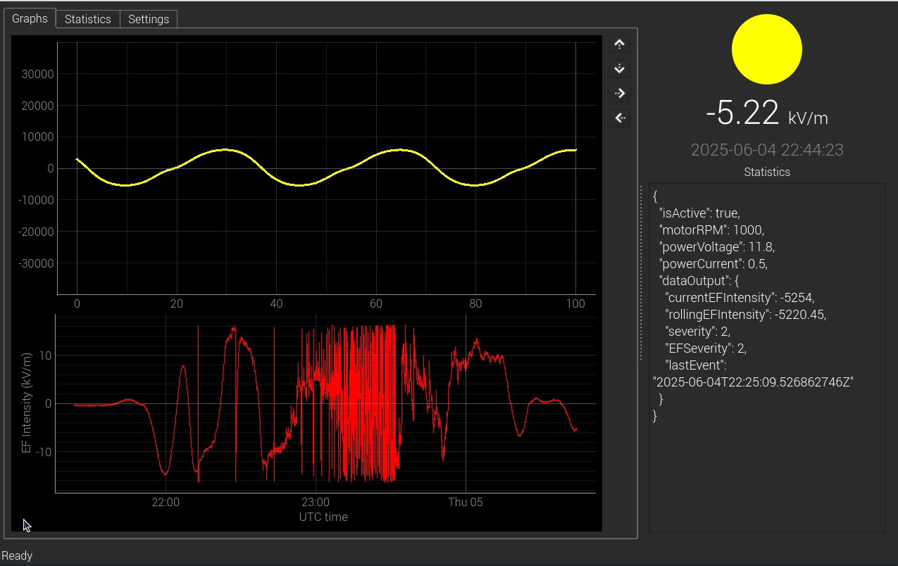
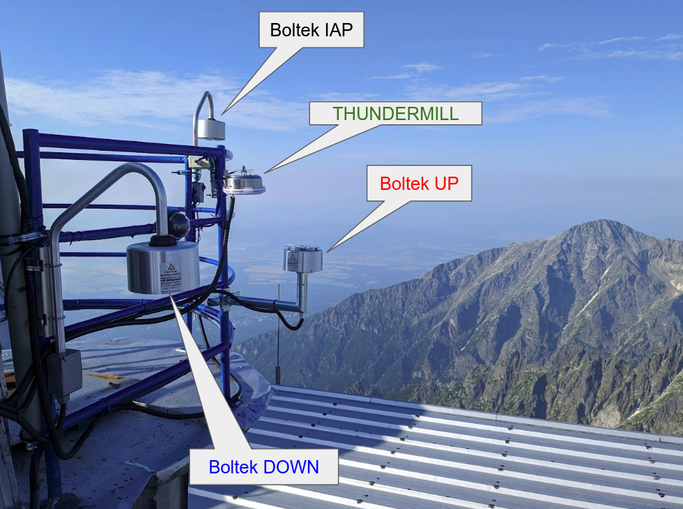
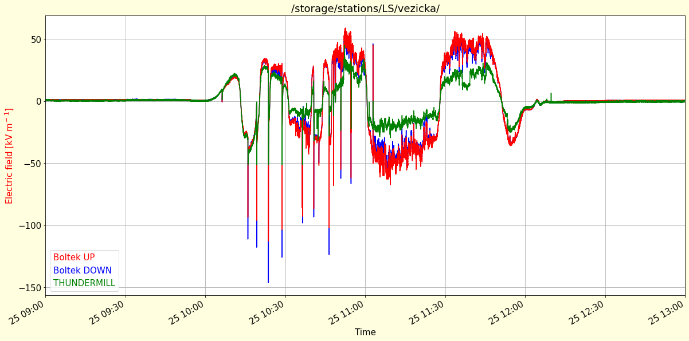

# THUNDERMILL01: Electric Field Mill Sensor

The THUNDERMILL01 is an advanced, high-precision electric field mill sensor developed for measuring static and semi-static electric fields. It offers consistent performance in stationary and portable setups in a broad range of meteorological conditions. Its robust design and precise measurement capabilities make it ideal for research institutions, meteorological monitoring, and industrial safety applications.

## What Does THUNDERMILL01 Measure?

The THUNDERMILL01 sensor measures the strength and approximate direction of atmospheric electric fields. Atmospheric electric fields result from the distribution of electric charges within clouds, between clouds and the Earth's surface, and within hydrometeors. By monitoring these fields, THUNDERMILL01 provides data for the enhancement of understanding storm dynamics, lightning activity, and evaluating the risk of electrical discharges. It is particularly valuable for researchers investigating atmospheric phenomena and seeking insight into the electrical interactions occurring during weather events.

## Applications

For detailed practical examples and operational scenarios, refer to [Use Cases Documentation](./usecases.md).

* **Meteorology:** Long-term monitoring and atmospheric analysis.
* **Thunderstorm and Weather Research:** Detailed observation of storm-induced electric field variations.
* **Industrial Safety:** Protecting equipment and personnel from electrical discharges.
* **Lightning Warning Systems:** Real-time monitoring for storm-related safety measures.
* **Emergency Management:** Decision support data during severe weather events.
* **Portable Field Studies:** Flexible deployment for temporary measurement campaigns.
* **HVDC Line Monitoring:** Continuous monitoring of the electric field for high-voltage DC transmission lines.

## How Does THUNDERMILL01 Work?

THUNDERMILL01 operates using a rotating shutter mechanism that periodically exposes and shields its sensing electrodes to the atmospheric electric field. This alternating exposure generates an induced charge on the electrodes, measured as a voltage signal (E [V] in the graph). The internal electronics then process these signals to quantify the electric field strength and its variations. The THUNDERMILL01 is unique in capturing a full waveform, which provides extensive data, allowing for advanced analyses such as identifying rapid fluctuations associated with lightning and detailed studies of electrical phenomena within thunderstorms. 

## Key Features

* **High Accuracy:** Precise electric field measurements suitable for scientific applications.
* **Fast Response Rate:** Captures rapid atmospheric phenomena, including lightning.
* **Waveform Storage:** Records complete waveforms for in-depth post-event analysis.
* **Real-Time Evaluation:** Enable instant insights into atmospheric conditions.
* **Remote Operation:** Supports optical fiber communication for secure and reliable remote monitoring.
* **GPS Tagging:** Optional, accurate time and location tagging of all recorded samples.
* **Open-Source Integration:** Comes with an open-source Python-based utility for real-time visualization, data streaming, storage format handling, and automated alerting.
* **Robust Construction:** Weather-resistant with long-term durability in extreme conditions.
* **Portability:** Lightweight design for easy relocation.
* **Compliance:** Adheres to [IEEE standard 2819-2022](https://ieeexplore.ieee.org/document/9790051) for electromagnetic environment measurement.

## Technical Specifications

Some technical parameters, like resolution and measurement range, could be customized for the specific application required by the customer. 

| Parameter             |Specification        |
| ------------------------------ | --------------------------------------------------- |
| **Measurement Range**          | ±100 kV/m                         |
| **Resolution**                 | 10 V/m                                               |
| **Accuracy**                   | ±5%                                               |
| **Raw Data**                   | Complete waveform capture                                  |
| **Processed Output**           | Electric field intensity                                          
| **E-Field intensity sampling Rate**     | 25 Hz Typical (Depends on FMOT setup)     |
| **Time resolution**            | 521 us (Corresponds to ADC sample rate)|
| **AC Field Immunity**          | Up to 40 dB                                   |
| **Time Tagging**               | Optional Multi-constellation GNSS receiver           |
| **Motor Type**                 | Brushless DC (BLDC)                            |
| **Dimensions**                 | Cylindrical; 155x120mm                       |
| **Mounting Options**           | Tripod, wall mount, ground screws                 |
| **Orientation**                | Down-looking (standard) or up-looking (optional) |
| **EFM Power Input**            | 12-16 VDC, 2A (optional AC supply 110-250 VAC)       |
| **Power Consumption**          | \~5 W            |
| **Optical Communication**      | RS232/RS485, Long-range optical             |
| **USB Interface**              | Firmware updates and local configuration         |
| **Terminal Power Input**       | 12-16 VDC, 2A or 110-250 VAC                   |
| **Communication Interfaces**   | Optical connector, metal wiring      |
| **Data Visualization**         | Built-in open-source application      |
| **Output Interfaces**          | Ethernet (1000T-base), Wi-Fi, RS232/RS485; optional LTE, LoRaWAN, CAN |
| **Local Storage**              | 255 GB, expandable                           |
| **Data Outputs**               | Raw waveform files, JSON API, graphical historical data, TCP/IP data streams |
| **EFM Temperature Range**      | -40°C to 40°C                         |
| **EFM Humidity Range**         | 0–100% RH                                                 |
| **Weatherproof Rating**        | IP44                                              |
| **Terminal Temperature Range** | -10°C to 30°C                                      |
| **Terminal Humidity Range**    | 8–90% RH (non-condensing)      |

## System Architecture

The THUNDERMILL01 system consists of two core components: the sensor unit (EFM) and the terminal unit.

  * The **sensor unit** is responsible for direct electric field measurement using a rotating electrode system. It is designed for outdoor deployment, with internal electronics for signal processing, and environmental protection to withstand harsh conditions.
  * The **terminal unit** serves as the primary interface for configuration, data storage, and communication. It supports real-time visualization, remote access, and integration with external systems. The terminal connects to the sensor via optical or metal-wired links and houses local storage as well as embedded software tools.

This modular architecture allows for flexible deployment in both portable and fixed installations, with high reliability across various atmospheric monitoring scenarios.

## Terminal unit

The terminal unit is a compact hardware running a Linux-based operating system. It serves as the central processing and communication hub of the THUNDERMILL system.

It provides multiple physical interfaces for connecting external devices and is linked to the sensor unit via a cable, which carries both power and data signals. This ensures reliable communication between the measurement and control parts of the system.

The terminal integrates local data storage, enabling long-term recording of both raw and processed data directly on the device. The system is optimized for autonomous operation in both stationary and mobile applications — from permanent observatories to field campaigns or UAV-based missions.

The integration with research platforms, actuators, or cloud-based monitoring systems is therefore provided by the terminal and its software.

### Graphical User Interface

Terminal runs the GUI application. The application calculates the electric field intensity, detects lightning, and generates trigger output.  It also provides an API for external data access and automation, alongside support for multiple output formats, including raw waveform files, processed electric field intensity, graphical time series, and real-time TCP/IP data streams. 

## Comparative Analysis

A comparative analysis against conventional sensors (e.g., Boltek EFM-100) has demonstrated significant performance advantages in measurement range, response flexibility, and portability, making THUNDERMILL01 particularly suited for advanced meteorological studies and real-time monitoring scenarios.

## Maintenance

The THUNDERMILL01 sensor is designed to require minimal maintenance. However, to ensure optimal performance and accuracy, it is recommended to inspect and clean the device at least once per season. Removing dust and other debris using compressed air or a soft brush helps maintain the device's functionality, calibration, and prolongs its service life.

### Transport and Field Deployment

The EFM and accessories are packaged in a rugged **Eurobox-type logistics container (30 × 40 × 27 cm)**, suitable for field logistics and automated handling systems.

  - Outer dimensions: 30 × 40 × 27 cm  
  - Material: High-quality PP  
  - Packaging weight: ~5 kg
  - Euro-pallet capacity: up to 72 units per 120 × 80 cm pallet  

All components THUNDERMILL01, terminal, cabling, and spare parts, are organized into custom-fit compartments. Thanks to this design, the entire system can be shipped and handled like conventional laboratory or industrial equipment, improving handling ergonomics and streamlining deployment workflows.

## Experimental Results

Measurements conducted with THUNDERMILL01 during thunderstorm events have provided insights, notably:

* Enhanced detection and differentiation of atmospheric electric field variations.
* Advanced capability to deduce directional information of electric field sources.

For a discussion of angular‑sensitive electric field mill measurements in thunderstorms, see the paper [Measurements with Angular Sensitive Electric Field Mill in Thunderstorms](https://iopscience.iop.org/article/10.1088/1742-6596/2985/1/012014/pdf).
