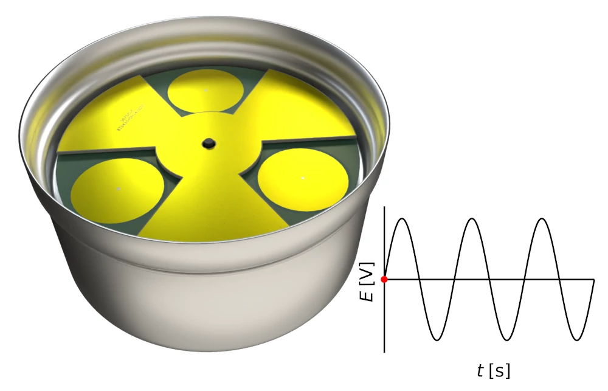
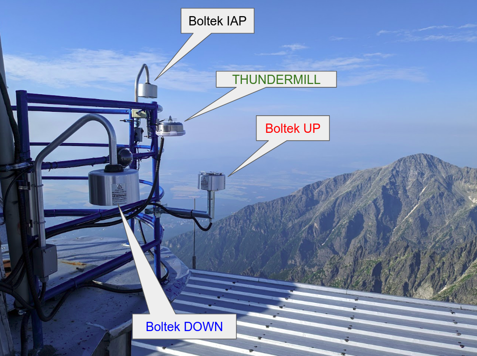
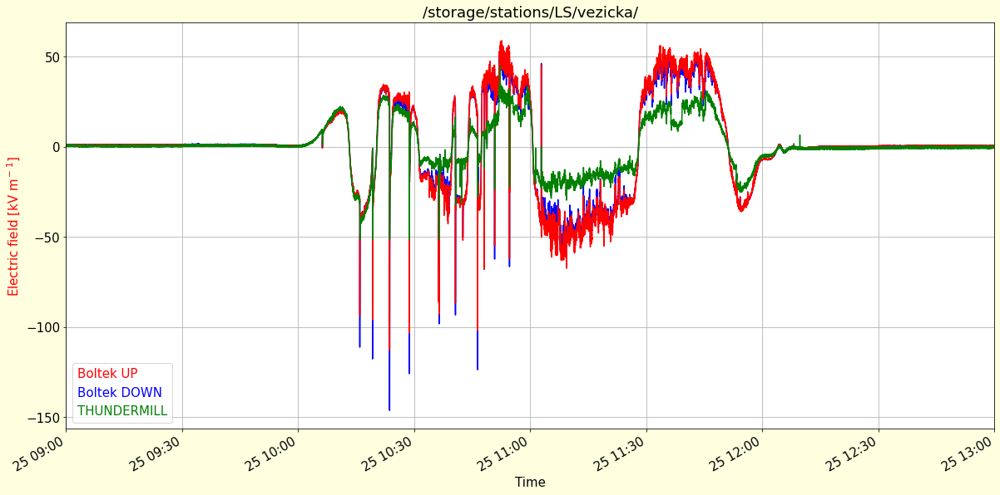

# THUNDERMILL01: Lightweight Portable Electric Field Mill Sensor

The THUNDERMILL01 is an advanced, high-precision electric field mill sensor developed for measuring static and semi-static electric fields. It offers consistent performance in stationary and portable setups in a broad range of meteorological conditions. Its robust design and precise measurement capabilities make it ideal for research institutions, meteorological monitoring, and industrial safety applications.

## What Does THUNDERMILL01 Measure?

The THUNDERMILL01 sensor measures the strength and approximate direction of atmospheric electric fields. Atmospheric electric fields result from the distribution of electric charges within clouds, between clouds and the Earth's surface, and within hydrometeors. By monitoring these fields, THUNDERMILL01 provides data for the enhancement of understanding storm dynamics, lightning activity, and evaluating the risk of electrical discharges. It is particularly valuable for researchers investigating atmospheric phenomena and seeking insight into the electrical interactions occurring during weather events.

## Applications

For detailed practical examples and operational scenarios, refer to [Use Cases Documentation](./usecases.md).

* **Meteorology:** UAV-based monitoring and atmospheric analysis.
* **Thunderstorm and Weather Research:** Detailed observation of storm-induced electric field variations.
* **Industrial Safety:** Protecting equipment and personnel from electrical discharges.
* **Lightning Warning Systems:** Real-time monitoring for storm-related safety measures.
* **Emergency Management:** Decision support data during severe weather events.
* **Portable Field Studies:** Flexible deployment for temporary measurement campaigns (balloons, drone, cars).

## How Does THUNDERMILL01 Work?

THUNDERMILL01 operates using a rotating shutter mechanism that periodically exposes and shields its sensing electrodes to the atmospheric electric field. This alternating exposure generates an induced charge on the electrodes, measured as a voltage signal (E [V] in the graph). The internal electronics then process these signals to quantify the electric field strength and its variations. The THUNDERMILL01 is unique in capturing a full waveform, which provides extensive data, allowing for advanced analyses such as identifying rapid fluctuations associated with lightning and detailed studies of electrical phenomena within thunderstorms. 

## Key Features

* **Fast Response Rate:** Captures rapid atmospheric phenomena, including lightning.
* **Waveform Capture:** Provides complete waveforms for in-depth event analysis.
* **Real-Time data:** Enable instant processing of atmospheric conditions.
* **GPS Tagging:** Optional time and location tagging of all recorded samples.
* **Open-Source:** Open-source hardware and firmware
* **Portability:** Lightweight design applicable to airborne in-situ measurement.
* **Compliance:** Adheres to [IEEE standard 2819-2022](https://ieeexplore.ieee.org/document/9790051) for electromagnetic environment measurement.

## Technical Specifications

Some technical parameters, like resolution and measurement range, could be customized for the specific application required by the customer. 

| Parameter             |Specification        |
| ------------------------------ | --------------------------------------------------- |
| **Measurement Range**          | ±100 kV/m                         |
| **Resolution**                 | 50 V/m                                               |
| **Accuracy**                   | ±5%                                               |
| **Raw Data**                   | Complete waveform capture                                  |
| **Processed Output**           | Electric field intensity                                          
| **E-Field sampling Rate**     | 25 Hz Typical (Depends on shutter RPM)     |
| **Time resolution**            | 521 us (Corresponds to ADC sample rate)|
| **Time Tagging**               | External Multi-constellation GNSS receiver           |
| **Motor Type**                 | External rotation force (eg. engine, turbine, or popeller rotor)  |
| **Dimensions**                 | Cylindrical; 80x20 mm                       |
| **Mass**                 | 34 grams (without cabling)          |
| **Power Consumption**          | 20 mA@5V + External rotation force (5 W maximum) |
| **Data Interface**       |  UART             |
| **Temperature Range**      | -40°C to 40°C                         |
| **Humidity Range**         | 0–90% RH                                                 |
| **Weatherproof Rating**        | IP03                                              |

## System Architecture

THUNDERMILL01 is not a standalone instrument. It is intended as a sensing module for integration into a larger host platform, such as ground-based logging unit, stratospheric balloon or UAV.

The device needs to be mechanically integrated into an external system that provides the required supporting functions:

* **Power supply** for the internal electronics
* **UART interface** for configuration and data logging
* **A source of rotation** for the field mill shutter

THUNDERMILL01 itself performs electric field sensing and signal processing, but its operation depends on the surrounding host system. This architecture allows the sensor to be adapted to a wide range of airborne and ground-based applications, while keeping the sensing subsystem compact and modular.

### Connector pinouts

#### TF Payload port

This connector is primarily intended for time synchronization with the [TFGPS01 GNSS receiver](https://docs.thunderfly.cz/avionics/TFGPS01/), which provides location and time pulse signals (PPS) on its "Payload Connector".

| Signal    | Pixhawk Color                | ThunderFly Color                                  |
| --------- | ------------------------------------------------------- | ----------------------------------------------------------------------------------- |
| TIMEPULSE |  Black |  Blue     |
| EXTINT    |  Black |  Yellow |
| GPIO |  Black |  White   |
| SDA       |  Black |  Green   |
| SCL       |  Black |  Yellow |
| TX        |  Black |  White   |
| RX        |  Black |  Green   |
| GND       |  Black |  Black   |

#### J6 - Debug & programming UART Port

The UART interface is compatible with the [Pixhawk connector standard](https://github.com/pixhawk/Pixhawk-Standards/blob/master/DS-009%20Pixhawk%20Connector%20Standard.pdf) as a peripheral device and enables integration with onboard flight controllers. CTS is disconnected, and the RTS signal is used for the MCU reset for bootloader activation. 

| Signal | Pixhawk Color              | ThunderFly Color          |
| ------ | -------------------------- | ---------------------- |
| +5V    |  Red     |  Red       |
| RX     |  Black |  White   |
| TX     |  Black |  Green   |
| Not connected (CTS)  |  Black |  Blue     |
| RTS    |  Black |  Yellow |
| GND    |  Black |  Black   |

#### J1 - Pixhawk UART & I2C

| Pin | Signal    | Voltage level | Pixhawk Color    | ThunderFly Color  |
|-----|-----------|---------| -------|---------|
| 1   | VCC       | +5V     |  Red     |  Red       |
| 2   | RX (IN)  | +3.3V   |  Black |  White   |
| 3   | TX (OUT)  | +3.3V   |  Black |  Green   |
| 4   | I2C SCL   | +3.3V   |  Black |  Yellow |
| 5   | I2C SDA   | +3.3V   |  Black |  Green   |
| 6   | GND       | GND     |  Black |  Black   |

## Comparative Analysis

A comparative analysis against conventional sensors (e.g., Boltek EFM-100) has demonstrated significant performance advantages in measurement range, response flexibility, and portability, making THUNDERMILL01 particularly suited for advanced meteorological studies and real-time monitoring scenarios.

## Experimental Results

Measurements conducted with THUNDERMILL01 during thunderstorm events have provided insights, notably:

* Enhanced detection and differentiation of atmospheric electric field variations.
* Advanced capability to deduce directional information of electric field sources.

For a discussion of angular‑sensitive electric field mill measurements in thunderstorms, see the paper [Measurements with Angular Sensitive Electric Field Mill in Thunderstorms](https://iopscience.iop.org/article/10.1088/1742-6596/2985/1/012014/pdf).
