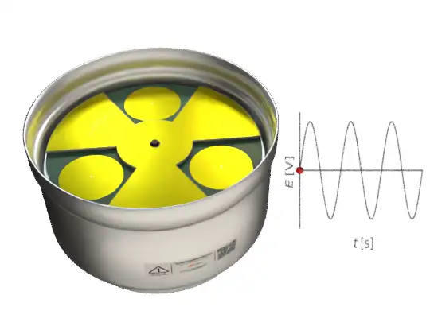

# Electric Field Sensors

The THUNDERMILL are an advanced, high-precision electric field mill sensor developed for measuring static and semi-static electric fields. It offers consistent performance in stationary and portable setups in a broad range of meteorological conditions. Its robust design and precise measurement capabilities make it ideal for research institutions, meteorological monitoring, and industrial safety applications.

## What Does THUNDERMILL0 Measure?

The THUNDERMILL01 sensor measures the strength and approximate direction of atmospheric electric fields. Atmospheric electric fields result from the distribution of electric charges within clouds, between clouds and the Earth's surface, and within hydrometeors. By monitoring these fields, THUNDERMILL01 provides data for the enhancement of understanding storm dynamics, lightning activity, and evaluating the risk of electrical discharges. It is particularly valuable for researchers investigating atmospheric phenomena and seeking insight into the electrical interactions occurring during weather events.

## Applications

For detailed practical examples and operational scenarios, refer to [Use Cases Documentation](./usecases.md).

* **Meteorology:** Long-term monitoring and atmospheric analysis.
* **Thunderstorm and Weather Research:** Detailed observation of storm-induced electric field variations.
* **Industrial Safety:** Protecting equipment and personnel from electrical discharges.
* **Lightning Warning Systems:** Real-time monitoring for storm-related safety measures.
* **Emergency Management:** Decision support data during severe weather events.
* **Portable Field Studies:** Flexible deployment for temporary measurement campaigns.
* **HVDC Line Monitoring:** Continuous monitoring of the electric field for high-voltage DC transmission lines.

## How Does THUNDERMILL01 Work?

THUNDERMILL01 operates using a rotating shutter mechanism that periodically exposes and shields its sensing electrodes to the atmospheric electric field. This alternating exposure generates an induced charge on the electrodes, measured as a voltage signal (E [V] in the graph). The internal electronics then process these signals to quantify the electric field strength and its variations. The THUNDERMILL01 is unique in capturing a full waveform, which provides extensive data, allowing for advanced analyses such as identifying rapid fluctuations associated with lightning and detailed studies of electrical phenomena within thunderstorms. 

## Scientific papers

* [In situ ground-based mobile measurement of lightning events above central Europe](https://amt.copernicus.org/articles/16/547/2023/)
* [Detection of Electromagnetic Phenomena in the Atmosphere – Integrating Advanced Instrumentation and UAVs for Enhanced Atmospheric Research](https://dspace.cvut.cz/handle/10467/120570)
* [Measurements with Angular Sensitive Electric Field Mill in Thunderstorms](https://iopscience.iop.org/article/10.1088/1742-6596/2985/1/012014/pdf).
