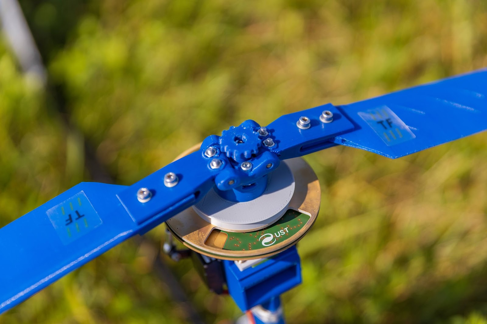
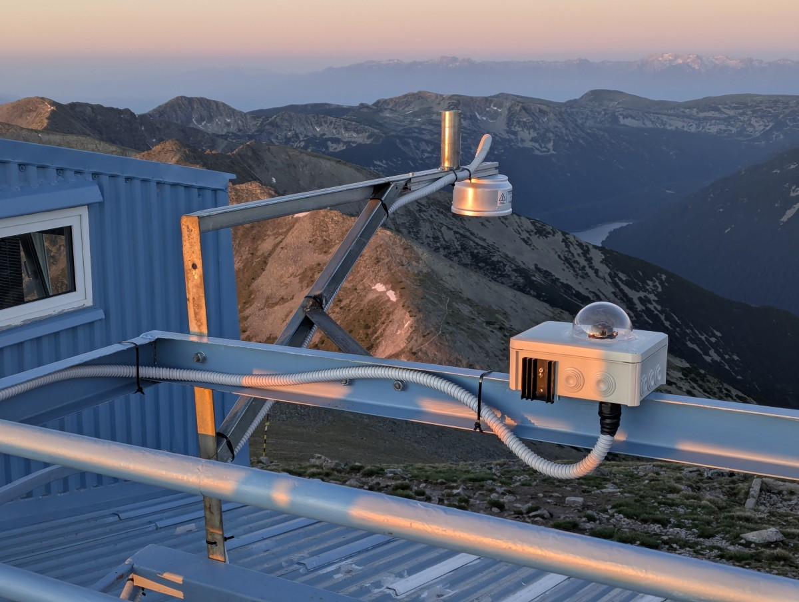

# THUNDERMILL Use Cases

The THUNDERMILL electric field mill sensor is a versatile instrument that can be deployed in a wide range of environments where electric field monitoring can prevent damage, save lives, or provide valuable scientific insights.

To realize its full potential, the THUNDERMILL sensor must be integrated with other systems or actuators that can respond to the detected electric field conditions. While it provides sensing, it requires downstream systems to interpret the data and perform actions such as alerting, logging, or activating safety mechanisms. Below are several promising and explored applications:

## Early Warning for Outdoor Public Events

Lightning-related safety for large crowds at festivals, concerts, or sports events is a growing concern. The THUNDERMILL sensor can:

* Deliver local, in-situ detection of dangerous electric field conditions.
* Operate offline or as part of a mesh of local detectors.
* Trigger alarms or guide safety protocols, such as clearing grandstands or pausing concerts.

The key advantage lies in its ability to operate without Internet connectivity and with highly local spatial sensitivity compared to long-range lightning networks.

## Livestock Protection

Animals are especially vulnerable to lightning because they often graze in open, elevated terrain, where they may be exposed to hazardous step voltages during lightning events. THUNDERMILL could be used to:

* Warn of approaching electric field threats in farming areas.
* Trigger audible or mechanical feeding systems to herd animals toward safer zones.

Documented cases of mass animal casualties due to lightning include:

* [Over 40 goats killed in Jammu & Kashmir](https://www.thehansindia.com/news/national/over-40-sheep-goats-killed-in-lightning-strike-in-jks-ganderbal-972663)
* [Hundreds of goats struck in Somalia](https://warsheekh.com/hundreds-of-goats-killed-by-lightning-strike-in-hiiraan-region/)

## Lightning Warning for Airports

Airports are high-risk locations for lightning-related incidents that may endanger ground operations. The THUNDERMILL system can:

* Monitor static electric field buildup over airport areas in real time.
* Provide additional input for operational decisions, such as aircraft landing suspension or maintenance activity planning.
* Function autonomously and locally without reliance on cloud services.
* Complement existing meteorological radar and lightning detection infrastructure.

This approach has been considered at major airports such as Schiphol [KNMI IR2013-01 report](https://cdn.knmi.nl/knmi/pdf/bibliotheek/knmipubIR/IR2013-01.pdf).

## Industrial and High-Voltage Zone Safety

Electric field mills can improve workplace safety in areas with exposed or sensitive high-voltage equipment by:

* Monitoring static field thresholds to prevent unwanted discharges.
* Automatically halting processes or alerting staff to hazardous conditions.
* Logging exposure levels to support incident investigations.

## Scientific Research and Education

THUNDERMILL sensors have already been deployed in several prominent research environments:

* **Lomnický Štít High-Mountain Observatory, Slovakia** – Three THUNDERMILL01 sensors have been continuously operating under extreme weather conditions at 2634 masl, supporting long-term atmospheric studies.
* **CRREAT Project, Nuclear Physics Institute, Czech Republic** – Used for vehicle-mounted studies of electric fields beneath thunderstorm clouds, focusing on lightning-related high-energy events.
* **ThunderFly UAV Platform, Czech Republic** – Integrated into the avionics of the [TF-G2 autogyro](https://docs.thunderfly.cz/instruments/TF-G2) as part of the [TF-ATMON system](https://docs.thunderfly.cz/instruments/TF-ATMON) for in-situ EFM measurements near and inside storm clouds.
* **Musala High-Mountain Observatory, Bulgaria** – Planned long-term EF monitoring at nearly 3000 masl in the Rila Mountains.

THUNDERMILL has been used in atmospheric research projects such as TGE (Thunderstorm Ground Enhancement) and serves as a tool for:

* Investigating storm-related ionizing radiation events.
* Studying atmospheric charge distributions from ground level.
* Triggering other instruments based on detecting cloud-to-ground (CG) lightning events, enabling synchronized measurements and data collection.
* Mapping electric fields and localizing electric charges within thunderclouds using UAV-mounted THUNDERMILL sensors, allowing detailed spatial analysis that is unachievable from the ground.

### Electric charges localization 

The research ([In situ ground-based mobile measurement of lightning events above central Europe](https://amt.copernicus.org/articles/16/547/2023/)) highlights that to accurately determine the spatial distribution of electric charge in thunderclouds, the electric field mill must be positioned closer to the cloud base. This can be achieved, for instance, by deploying the THUNDERMILL sensor on UAV platforms, enabling measurements that are not feasible from the ground alone. THUNDERMILL01, due to its compact and lightweight design, is suitable for such airborne applications and can provide high-resolution data even when carried by UAVs.

### Lightning-based trigger signal generator 

Due to its selective sensitivity to cloud-to-ground (CG) lightning and low sensitivity to intracloud discharges, THUNDERMILL can also be used to trigger high-speed cameras in optical lightning studies. This makes it ideal for capturing CG discharges within distances of several tens of kilometers, where precise timing is required.

## Renewable Energy Facilities

High electric field environments near wind farms or photovoltaic power plants can trigger preemptive procedures such as shutdowns, reconfiguration, or insulation protocols, which can help mitigate damage and ensure continuity of critical operations during thunderstorm conditions.

