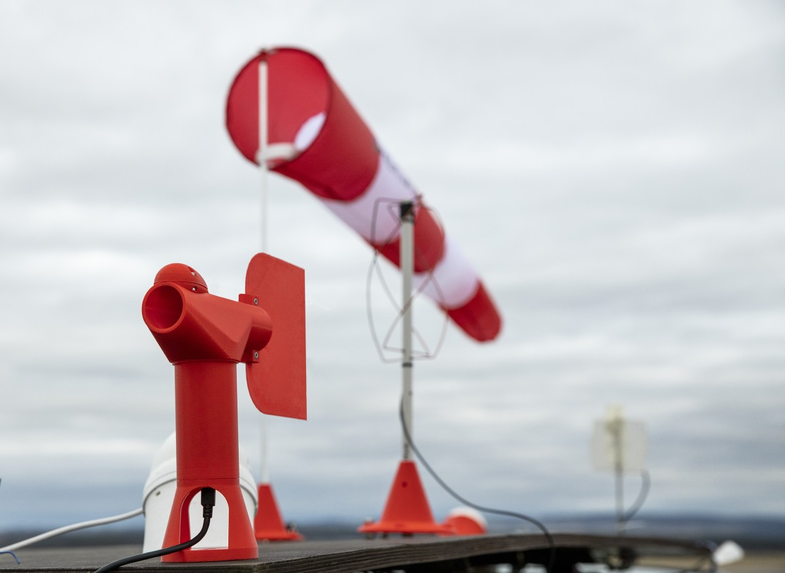
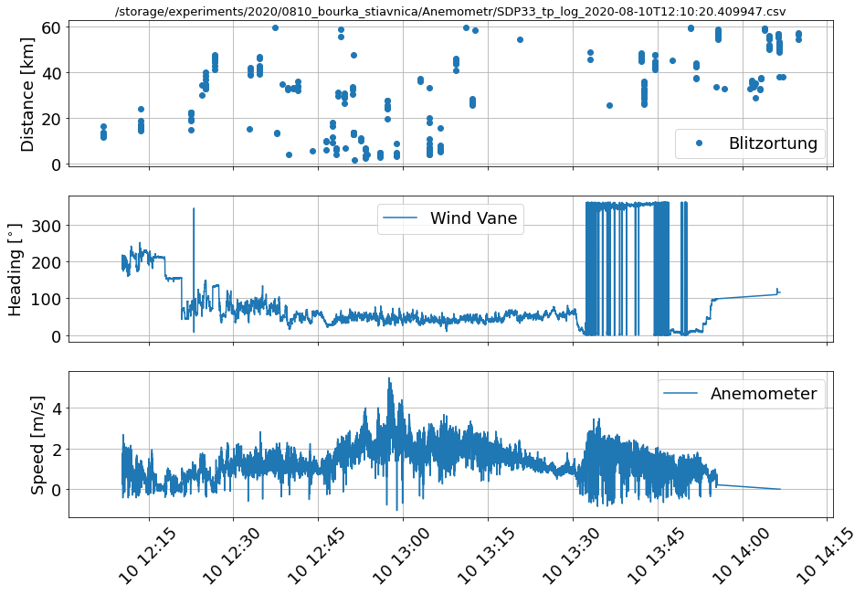

# WINDGAUGE03 — Storm-resistant Venturi Anemometer

WINDGAUGE03 is a no-moving-parts wind sensor designed for use on vehicle roof platforms in storm and hail conditions. It uses the differential pressure between two openings of different cross-section (the Venturi principle) instead of the cups, propellers, or ultrasonic transducers of conventional anemometers. An internal magnetometer measures the absolute wind direction relative to magnetic north, so the sensor does not need to be physically aligned to a fixed bearing.

## Why a new anemometer?

The motivation for WINDGAUGE03 was the **failure of a standard cup anemometer** during its first deployment on a highway drive — the cups disintegrated under high-speed airflow. Conventional weather-station anemometers are not built to survive sustained 130 km/h driving wind loads plus hail impacts, which is the routine operating envelope of a storm-chasing measurement vehicle.

The alternative requirements were:

* No fragile rotating parts (cups, propellers).
* Tolerance to hail and rain at highway speeds.
* Lower aerodynamic drag than a cup anemometer, which doubles as a power-saver and a vibration-source eliminator.
* Wind-direction measurement that survives the rotation of the host vehicle (e.g. when the car is parked at an arbitrary heading near a storm).

The Venturi design directly solves the first three requirements. The fourth one is addressed by integrating a magnetometer on the same PCB, so wind direction is reported in geographic frame — no need for a separate, fixed-direction reference installation.

## Sensing principle

The two openings of WINDGAUGE03 have different cross-section areas $A_D$ and $A_d$, so by Bernoulli's principle and conservation of mass the velocities and the pressure difference $\Delta p$ are related by

$$
\Delta p = \tfrac12 \rho \, v_\infty^2 \left[\left(\frac{A_D}{A_d}\right)^2 - 1\right] \;\Rightarrow\; v_\infty = \sqrt{\frac{2 \Delta p}{\rho\left[\left(A_D/A_d\right)^2 - 1\right]}}.
$$

This makes WINDGAUGE03 *more sensitive* than a Pitot-static tube at the same airspeed in any geometric configuration where $A_D/A_d > \sqrt{2}$. The trade-off is an increase in aerodynamic drag, which is negligible at the wind speeds the instrument is designed for.

The Venturi-shaped sensing aperture is paired with two physical sensors on the readout PCB:

* a **differential pressure sensor**, giving $\Delta p$ and thus $v_\infty$;
* a **magnetometer**, giving the orientation of the sensor body and, combined with the known orientation of the sensing aperture, the direction of the incoming wind in the local geographic frame.

The pressure-only readout is intrinsically agnostic of magnetic field, so it remains accurate near power lines, near the vehicle body, and during thunderstorms when local magnetic disturbances are common. The magnetometer is used only for the bearing, and is calibrated against the platform.

## Field example

An example record from the edge of a thunderstorm — lightning detections from Blitzortung in the top panel, wind direction in the middle, wind speed in the bottom panel — is shown below:

## Comparison with previous compensation methods

Earlier iterations of the measuring vehicles used a separate **RTK GNSS receiver** ([uBlox NEO-M8P](https://www.u-blox.com/en/product/neo-m8p-series), three of them in moving-baseline configuration) to recover vehicle orientation. While this works in principle, it is fragile in practice: any interruption of the GNSS signal phase (highway bridges, tree-covered roads) corrupts the orientation solution, and the receiver is not robust at signalling when the moving-baseline output is invalid. WINDGAUGE03 sidesteps this problem entirely by deriving the bearing from a local magnetometer, with the trade-off that any large local ferromagnetic disturbance must be calibrated out at install time.

## Related publications

* J. Kákona, [_Detection of Electromagnetic Phenomena in the Atmosphere – Integrating Advanced Instrumentation and UAVs for Enhanced Atmospheric Research_](https://dspace.cvut.cz/handle/10467/120570), doctoral thesis, CTU in Prague, 2025.

For the closely related **TFSLOT01** UAV airspeed sensor (the same Venturi principle, but integrated into the rotor head of the [TF-G2 autogyro](https://docs.thunderfly.cz/instruments/TF-G2)), see ThunderFly's documentation.
